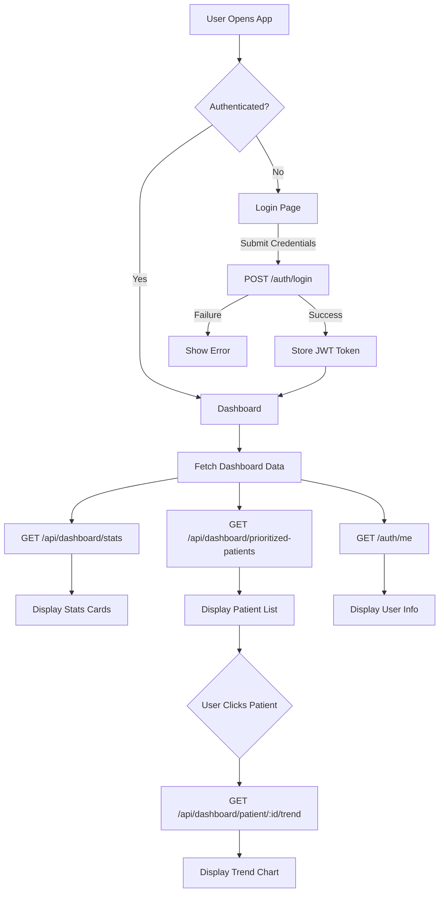
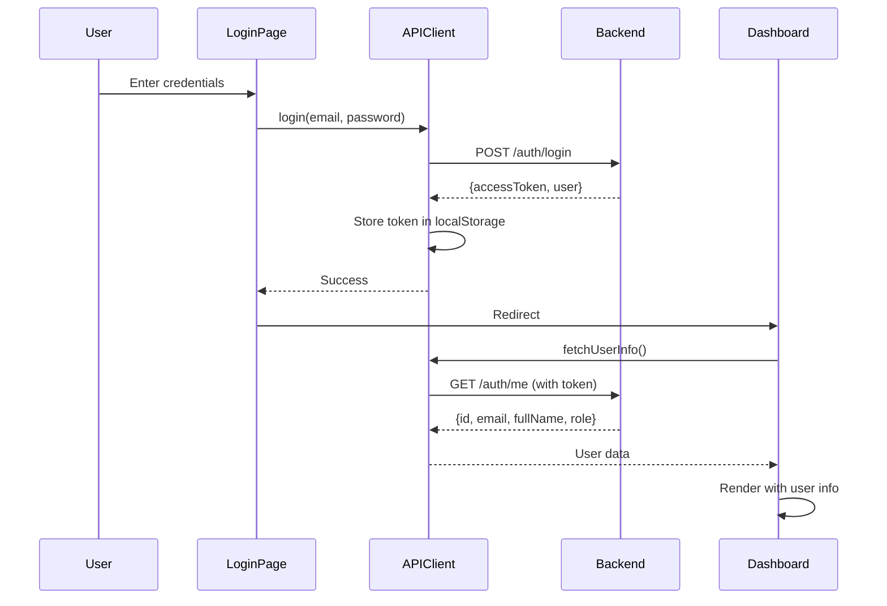

# Design Document: Clinic UI Prototype

## Overview

The clinic UI prototype is a React-based web application that provides a medical dashboard interface for viewing patient monitoring data. The application integrates with an existing FastAPI backend to display real-time statistics, patient risk levels, trend analysis, and clinical data visualizations.

**Key Design Principles:**
- **Simplicity First**: Use only React functional components with minimal hooks (useState, useEffect)
- **Plain CSS**: No frameworks, preprocessors, or CSS-in-JS - just standard CSS files
- **Beginner-Friendly**: Clear, readable code that prioritizes understanding over optimization
- **Backend Integration**: Fetch real data from FastAPI endpoints with JWT authentication
- **Medical Aesthetic**: Clean, professional healthcare theme with clinical color palette

**Technology Stack:**
- React 18+ (functional components only)
- Plain CSS (no frameworks)
- Recharts (for data visualizations)
- Native Fetch API (for HTTP requests)
- Vite (for development tooling)

## Architecture

### High-Level Structure

```
clinic-ui/
├── public/
│   └── index.html
├── src/
│   ├── components/
│   │   ├── Login.jsx
│   │   ├── Dashboard.jsx
│   │   ├── Navigation.jsx
│   │   ├── StatsCard.jsx
│   │   ├── PatientList.jsx
│   │   └── TrendChart.jsx
│   ├── styles/
│   │   ├── App.css
│   │   ├── Login.css
│   │   ├── Dashboard.css
│   │   ├── Navigation.css
│   │   ├── StatsCard.css
│   │   ├── PatientList.css
│   │   └── TrendChart.css
│   ├── api/
│   │   └── client.js
│   ├── App.jsx
│   └── main.jsx
├── .env
├── package.json
└── README.md
```

### Application Flow



### Authentication Flow



## Components and Interfaces

### 1. API Client Module (`api/client.js`)

**Purpose**: Centralized HTTP request handling with JWT token management

**Key Functions:**

```javascript
// Authentication
async function login(email, password)
  → Returns: {accessToken, user}
  → Stores token in localStorage
  → Endpoint: POST /auth/login

async function logout()
  → Clears token from localStorage
  → Redirects to login

async function fetchUserInfo()
  → Returns: {id, email, fullName, role}
  → Endpoint: GET /auth/me

// Dashboard Data
async function fetchDashboardStats()
  → Returns: {totalPatients, appointmentsToday, highRiskAlerts, ...}
  → Endpoint: GET /api/dashboard/stats

async function fetchPrioritizedPatients(clinicianId?)
  → Returns: Array of patient objects with risk/trend data
  → Endpoint: GET /api/dashboard/prioritized-patients

async function fetchPatientTrend(patientId)
  → Returns: Array of trend data points
  → Endpoint: GET /api/dashboard/patient/{patientId}/trend

// Helper Functions
function getAuthToken()
  → Retrieves JWT from localStorage

function makeAuthenticatedRequest(url, options)
  → Adds Authorization header with Bearer token
  → Handles 401 responses by redirecting to login
  → Handles network errors with user-friendly messages
```

**Error Handling Strategy:**
- Network errors: Display "Unable to connect to server" message
- 401 Unauthorized: Clear token and redirect to login
- 403 Forbidden: Display "Access denied" message
- 500 Server errors: Display "Server error, please try again"
- All errors logged to console for debugging

### 2. Login Component (`components/Login.jsx`)

**Purpose**: User authentication interface

**State:**
- `email` (string): User email input
- `password` (string): User password input
- `error` (string): Error message to display
- `loading` (boolean): Loading state during authentication

**Behavior:**
- On form submit: Call `login(email, password)` from API client
- On success: Redirect to `/dashboard`
- On failure: Display error message below form
- Clear error when user starts typing

**UI Elements:**
- Email input field
- Password input field
- Submit button (disabled during loading)
- Error message area
- Medical-themed background or logo

### 3. Dashboard Component (`components/Dashboard.jsx`)

**Purpose**: Main application view displaying all patient monitoring data

**State:**
- `stats` (object): Dashboard statistics from backend
- `patients` (array): Prioritized patient list
- `userInfo` (object): Current user information
- `selectedPatient` (object|null): Currently selected patient for trend view
- `loading` (boolean): Loading state for initial data fetch
- `error` (string): Error message if data fetch fails

**Lifecycle:**
- On mount: Fetch dashboard stats, prioritized patients, and user info
- On unmount: Clear any pending requests

**Child Components:**
- Navigation (with user info)
- 3+ StatsCard components (total patients, appointments today, high risk alerts)
- PatientList component
- TrendChart component (when patient selected)

### 4. Navigation Component (`components/Navigation.jsx`)

**Purpose**: Sidebar or topbar navigation with user info and logout

**Props:**
- `userInfo` (object): {fullName, role, email}

**UI Elements:**
- App logo/title
- Navigation links: Dashboard, Patients, Appointments, Reports (visual only, no routing)
- User info display (name and role badge)
- Logout button

**Behavior:**
- Highlight active section (Dashboard by default)
- On logout click: Call `logout()` from API client

### 5. StatsCard Component (`components/StatsCard.jsx`)

**Purpose**: Display a single metric with icon and value

**Props:**
- `label` (string): Metric name (e.g., "Total Patients")
- `value` (number|string): Metric value
- `icon` (string): Icon identifier or emoji
- `color` (string): Accent color for the card

**UI Elements:**
- Icon or symbol
- Large numeric value
- Descriptive label
- Optional trend indicator (up/down arrow)

**Styling:**
- White background with subtle shadow
- Colored left border or icon background
- Hover effect for depth

### 6. PatientList Component (`components/PatientList.jsx`)

**Purpose**: Display prioritized patients with risk levels and trends

**Props:**
- `patients` (array): Array of patient objects
- `onPatientClick` (function): Callback when patient is selected

**Patient Object Structure:**
```javascript
{
  id: number,
  fullName: string,
  currentRiskLevel: "LOW" | "MEDIUM" | "HIGH",
  currentTrendStatus: "IMPROVING" | "STABLE" | "WORSENING",
  lastReportTime: ISO date string,
  chronicConditions: string[] (parsed from JSON)
}
```

**UI Elements:**
- Scrollable list of patient cards
- Each card shows:
  - Patient name
  - Risk level badge (color-coded: red=HIGH, yellow=MEDIUM, green=LOW)
  - Trend status indicator (arrow: ↑=IMPROVING, →=STABLE, ↓=WORSENING)
  - Last report time (formatted as relative time: "2 hours ago")
  - Chronic conditions (if any)

**Behavior:**
- On patient click: Call `onPatientClick(patient)` to load trend chart
- Highlight selected patient
- Sort order maintained from backend (already prioritized)

### 7. TrendChart Component (`components/TrendChart.jsx`)

**Purpose**: Display patient symptom trend data over time

**Props:**
- `patientId` (number): ID of patient to display
- `patientName` (string): Name for chart title

**State:**
- `trendData` (array): Trend data points from backend
- `loading` (boolean): Loading state while fetching
- `error` (string): Error message if fetch fails

**Lifecycle:**
- On mount or patientId change: Fetch trend data from `/api/dashboard/patient/{patientId}/trend`

**Chart Configuration:**
- Library: Recharts LineChart
- X-axis: Date/time of symptom reports
- Y-axis: Risk score (0-100)
- Line color: Based on risk level (green → yellow → red gradient)
- Tooltip: Show date, risk score, severity, symptoms

**UI Elements:**
- Chart title with patient name
- Recharts LineChart component
- Legend explaining risk levels
- Loading spinner while fetching
- Error message if fetch fails

## Data Models

### Frontend Data Structures

**User Info:**
```javascript
{
  id: number,
  email: string,
  fullName: string,
  role: "PATIENT" | "CLINICIAN" | "ADMIN"
}
```

**Dashboard Stats:**
```javascript
{
  totalPatients: number,
  appointmentsToday: number,
  highRiskAlerts: number,
  activeAssignments: number,
  recentReports: number
}
```

**Patient Object:**
```javascript
{
  id: number,
  fullName: string,
  currentRiskLevel: "LOW" | "MEDIUM" | "HIGH",
  currentTrendStatus: "IMPROVING" | "STABLE" | "WORSENING",
  lastReportTime: string (ISO 8601),
  chronicConditions: string[], // Parsed from JSON
  emergencyContact: string,
  dateOfBirth: string (ISO 8601),
  gender: string
}
```

**Trend Data Point:**
```javascript
{
  date: string (ISO 8601),
  riskScore: number (0-100),
  riskLevel: "LOW" | "MEDIUM" | "HIGH",
  severity: "MILD" | "MODERATE" | "SEVERE" | "CRITICAL",
  symptoms: string[] // Array of symptom names
}
```

### Backend API Contracts

**POST /auth/login**
- Request: `{email: string, password: string}`
- Response: `{accessToken: string, user: UserInfo}`
- Status: 200 OK, 401 Unauthorized

**GET /auth/me**
- Headers: `Authorization: Bearer {token}`
- Response: `UserInfo`
- Status: 200 OK, 401 Unauthorized

**GET /api/dashboard/stats**
- Headers: `Authorization: Bearer {token}`
- Response: `DashboardStats`
- Status: 200 OK, 401 Unauthorized

**GET /api/dashboard/prioritized-patients**
- Headers: `Authorization: Bearer {token}`
- Query: `?clinicianId={id}` (optional)
- Response: `Patient[]`
- Status: 200 OK, 401 Unauthorized

**GET /api/dashboard/patient/{patientId}/trend**
- Headers: `Authorization: Bearer {token}`
- Response: `TrendDataPoint[]`
- Status: 200 OK, 401 Unauthorized, 404 Not Found

## Error Handling

### API Error Handling

**Network Errors:**
- Catch fetch errors (network unavailable, CORS issues)
- Display: "Unable to connect to server. Please check that the backend is running on http://localhost:8000"
- Log full error to console

**HTTP Error Responses:**
- 401 Unauthorized: Clear token, redirect to login, display "Session expired, please log in again"
- 403 Forbidden: Display "You don't have permission to access this resource"
- 404 Not Found: Display "Resource not found"
- 500 Server Error: Display "Server error, please try again later"
- Log response body to console for debugging

**Timeout Handling:**
- Set fetch timeout to 10 seconds
- On timeout: Display "Request timed out, please try again"

### UI Error States

**Component-Level Errors:**
- Each component with async data maintains its own error state
- Display error message inline within component
- Provide retry button where appropriate

**Global Error Boundary:**
- Wrap App component with error boundary
- Catch React rendering errors
- Display fallback UI: "Something went wrong. Please refresh the page."

**Loading States:**
- Show loading spinner or skeleton UI while fetching data
- Disable interactive elements during loading
- Provide visual feedback for all async operations

## Testing Strategy

### Why Property-Based Testing Does Not Apply

This feature is **not suitable for property-based testing** because:

1. **UI Rendering**: The primary functionality is rendering React components based on data - there are no universal properties to test across all inputs
2. **External API Integration**: The application integrates with external backend endpoints - behavior depends on backend responses, not pure functions
3. **User Interaction**: Most functionality involves user interactions (clicks, form submissions) that are better tested with example-based tests
4. **Visual Design**: Many requirements focus on visual appearance and styling, which cannot be verified through property-based testing

**Appropriate Testing Strategies:**
- **Component snapshot tests**: Verify component rendering with example data
- **Integration tests**: Test API client functions with mocked fetch responses
- **Manual testing**: Verify visual design, responsiveness, and user experience
- **End-to-end tests**: Test complete user flows (login → dashboard → patient selection)

### Unit Testing Approach

**API Client Tests:**
- Test `login()` with valid credentials (mock successful response)
- Test `login()` with invalid credentials (mock 401 response)
- Test `fetchDashboardStats()` with mock data
- Test `fetchPrioritizedPatients()` with mock patient array
- Test `fetchPatientTrend()` with mock trend data
- Test token storage and retrieval
- Test 401 handling (should clear token and redirect)
- Test network error handling

**Component Tests:**
- Test Login component renders form elements
- Test Login component displays error message on failed login
- Test StatsCard component renders with provided props
- Test PatientList component renders patient cards
- Test PatientList component calls onPatientClick when patient clicked
- Test TrendChart component fetches data on mount
- Test Navigation component displays user info

**Integration Tests:**
- Test login flow: submit credentials → store token → redirect to dashboard
- Test dashboard data loading: fetch stats → fetch patients → render components
- Test patient selection: click patient → fetch trend data → display chart
- Test logout flow: click logout → clear token → redirect to login

**Manual Testing Checklist:**
- Visual design matches medical/clinical theme
- Color scheme is consistent (whites, blues, greens)
- Spacing and alignment are consistent
- Hover effects work smoothly
- Loading states display correctly
- Error messages are clear and helpful
- Responsive layout works on different screen sizes
- Backend integration works with real API

### Test Data Requirements

**Mock User Data:**
```javascript
{
  id: 1,
  email: "clinician@example.com",
  fullName: "Dr. Sarah Johnson",
  role: "CLINICIAN"
}
```

**Mock Dashboard Stats:**
```javascript
{
  totalPatients: 127,
  appointmentsToday: 8,
  highRiskAlerts: 3,
  activeAssignments: 45,
  recentReports: 12
}
```

**Mock Patient Data:**
```javascript
[
  {
    id: 1,
    fullName: "John Doe",
    currentRiskLevel: "HIGH",
    currentTrendStatus: "WORSENING",
    lastReportTime: "2025-01-15T10:30:00Z",
    chronicConditions: ["asthma", "diabetes"]
  },
  {
    id: 2,
    fullName: "Jane Smith",
    currentRiskLevel: "MEDIUM",
    currentTrendStatus: "STABLE",
    lastReportTime: "2025-01-15T09:15:00Z",
    chronicConditions: []
  }
]
```

**Mock Trend Data:**
```javascript
[
  {
    date: "2025-01-10T08:00:00Z",
    riskScore: 25,
    riskLevel: "LOW",
    severity: "MILD",
    symptoms: ["cough"]
  },
  {
    date: "2025-01-12T14:30:00Z",
    riskScore: 55,
    riskLevel: "MEDIUM",
    severity: "MODERATE",
    symptoms: ["cough", "fever"]
  },
  {
    date: "2025-01-15T10:30:00Z",
    riskScore: 78,
    riskLevel: "HIGH",
    severity: "SEVERE",
    symptoms: ["cough", "fever", "chest pain"]
  }
]
```

## Implementation Guidelines

### Code Style and Conventions

**Component Structure:**
```javascript
// Import statements
import React, { useState, useEffect } from 'react';
import './ComponentName.css';

// Component definition
function ComponentName({ prop1, prop2 }) {
  // State declarations
  const [state1, setState1] = useState(initialValue);
  
  // Effect hooks
  useEffect(() => {
    // Effect logic
  }, [dependencies]);
  
  // Event handlers
  const handleEvent = () => {
    // Handler logic
  };
  
  // Render
  return (
    <div className="component-name">
      {/* JSX */}
    </div>
  );
}

export default ComponentName;
```

**CSS Naming Convention:**
- Use kebab-case for class names
- Prefix component-specific classes with component name
- Example: `.stats-card`, `.stats-card-icon`, `.stats-card-value`

**Variable Naming:**
- Use camelCase for variables and functions
- Use descriptive names: `fetchDashboardStats` not `getData`
- Boolean variables start with `is`, `has`, `should`: `isLoading`, `hasError`

**Comments:**
- Add comments for non-obvious logic
- Explain why, not what (code should be self-explanatory)
- Document API response structures
- Note any workarounds or temporary solutions

### Color Palette

**Primary Colors:**
- Primary Blue: `#2563eb` (buttons, links, active states)
- Success Green: `#10b981` (LOW risk, IMPROVING trend)
- Warning Yellow: `#f59e0b` (MEDIUM risk)
- Danger Red: `#ef4444` (HIGH risk, WORSENING trend)

**Neutral Colors:**
- Background: `#f8fafc` (light gray)
- Card Background: `#ffffff` (white)
- Text Primary: `#1e293b` (dark gray)
- Text Secondary: `#64748b` (medium gray)
- Border: `#e2e8f0` (light gray)

**Accent Colors:**
- Info Blue: `#3b82f6`
- Stable Gray: `#6b7280`

### Responsive Breakpoints

**Desktop First Approach:**
- Primary target: 1280px and above
- Tablet: 768px - 1279px (optional)
- Mobile: below 768px (optional, low priority)

**Flexible Layout:**
- Use CSS Grid for main dashboard layout
- Use Flexbox for component internal layout
- Avoid fixed pixel widths where possible
- Use `max-width` for content containers

### Development Workflow

**Setup Steps:**
1. Create React app with Vite: `npm create vite@latest clinic-ui -- --template react`
2. Install dependencies: `npm install recharts`
3. Create folder structure: `components/`, `styles/`, `api/`
4. Create `.env` file with `VITE_API_URL=http://localhost:8000`
5. Start development server: `npm run dev`

**Development Order:**
1. Set up API client module with authentication functions
2. Build Login component and test authentication flow
3. Build Dashboard component shell with Navigation
4. Build StatsCard component and integrate with dashboard stats
5. Build PatientList component and integrate with prioritized patients
6. Build TrendChart component and integrate with patient trend data
7. Add styling and polish
8. Test with real backend
9. Add error handling and loading states
10. Final visual polish and responsive adjustments

**Testing During Development:**
- Test each component in isolation before integration
- Use browser DevTools to inspect API requests/responses
- Test with real backend running on localhost:8000
- Test error scenarios (backend down, invalid credentials, network errors)
- Test with different user roles (CLINICIAN, ADMIN)

### Backend Integration Notes

**CORS Configuration:**
- Backend must allow `http://localhost:5173` (Vite default port)
- Backend must allow credentials (for JWT cookies if used)
- If CORS errors occur, check backend `main.py` CORS settings

**Authentication Flow:**
- Store JWT token in `localStorage` (key: `authToken`)
- Include token in all authenticated requests: `Authorization: Bearer {token}`
- On 401 response, clear token and redirect to login
- Token expiration handled by backend (no client-side expiration check)

**Data Refresh Strategy:**
- Fetch dashboard data on component mount
- No automatic polling (keep it simple)
- User can refresh by navigating away and back
- Consider adding manual refresh button in future iteration

**Backend Availability:**
- Assume backend is running on `http://localhost:8000`
- Display clear error if backend is unreachable
- Include backend setup instructions in README
- Provide example credentials for testing

## Deployment Considerations

**Build Process:**
- Run `npm run build` to create production build
- Output in `dist/` folder
- Static files can be served by any web server

**Environment Configuration:**
- Use `.env` file for API URL configuration
- Create `.env.example` with template
- Document environment variables in README

**Production Readiness:**
- This is a prototype, not production-ready
- No authentication persistence beyond localStorage
- No token refresh mechanism
- No comprehensive error recovery
- No performance optimization
- No accessibility features (ARIA labels, keyboard navigation)

**Future Enhancements:**
- Add React Router for proper routing
- Add token refresh mechanism
- Add comprehensive error boundaries
- Add loading skeletons for better UX
- Add accessibility features (ARIA, keyboard navigation)
- Add unit tests with Jest and React Testing Library
- Add E2E tests with Playwright or Cypress
- Optimize bundle size and performance
- Add mobile-responsive design
- Add dark mode toggle
- Add data export functionality
- Add real-time updates with WebSockets

## Summary

This design provides a complete blueprint for building a simple, beginner-friendly React UI prototype that integrates with the existing FastAPI backend. The architecture prioritizes code clarity and simplicity while delivering a visually impressive medical dashboard interface.

**Key Design Decisions:**
1. **No complex state management**: Use component-level state only, no Redux/Context
2. **Centralized API client**: All backend communication through single module
3. **Component-based architecture**: Small, focused components with clear responsibilities
4. **Plain CSS**: No frameworks or preprocessors for maximum simplicity
5. **Desktop-first**: Prioritize desktop view, responsive design is optional
6. **Real backend integration**: Fetch actual data from FastAPI endpoints
7. **JWT authentication**: Standard Bearer token approach with localStorage

**Requirements Coverage:**
- ✅ React functional components only (Req 1)
- ✅ Plain CSS styling (Req 2)
- ✅ Medical dashboard theme (Req 3)
- ✅ Complete dashboard layout (Req 4)
- ✅ Navigation component (Req 5)
- ✅ Stats cards (Req 6)
- ✅ Chart visualization with Recharts (Req 7)
- ✅ Patient prioritization view (Req 8)
- ✅ Simple, readable code (Req 9)
- ✅ Minimal dependencies (Req 10)
- ✅ Simple project structure (Req 11)
- ✅ Backend integration (Req 12)
- ✅ Responsive layout (optional) (Req 13)
- ✅ Visual polish (Req 14)
- ✅ Simple development setup (Req 15)
- ✅ Authentication flow (Req 16)
- ✅ Token management (Req 17)
- ✅ Error handling (Req 18)
- ✅ Dashboard data integration (Req 19)
- ✅ User info display (Req 20)
- ✅ Backend connectivity handling (Req 21)

The design is ready for implementation with clear component boundaries, data flow, and integration points with the existing backend.
