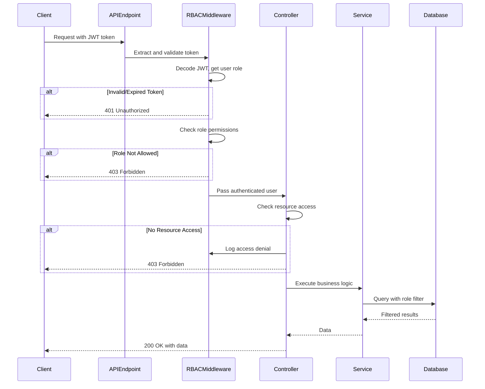
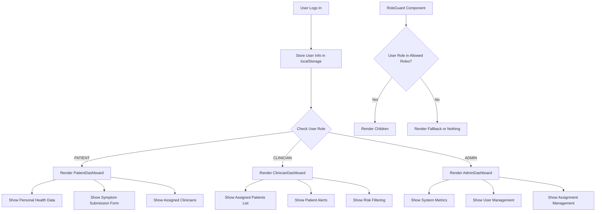

# Design Document: RBAC Role-Based UI

## Overview

This design document describes the technical implementation for Role-Based Access Control (RBAC) enforcement on the backend and Role-Based UI on the frontend for the Healthcare Platform. The implementation consists of three phases:

**Phase 1: Backend RBAC Enforcement** - Implements consistent RBAC middleware, patient/clinician/admin data access controls, and endpoint-level authorization for symptom reports, alerts, assignments, and dashboards.

**Phase 2: Frontend Role-Based UI** - Implements role-based authentication handling, reusable Role Guard component, role-specific dashboards (Patient, Clinician, Admin), role-based navigation and routing.

**Phase 3: Integration and Testing** - Implements end-to-end RBAC verification, frontend role switching tests, and security audit logging.

The approach extends the existing authentication system with comprehensive RBAC enforcement across all endpoints and renders role-appropriate UIs on the frontend.

**Key Design Decisions:**
- **Leverage Existing Auth**: Build on existing JWT authentication with role in token payload
- **Middleware Pattern**: Use FastAPI dependency injection for consistent RBAC enforcement
- **Resource-Level Access**: Implement fine-grained access control for patient data
- **Role-Specific Components**: Create separate dashboard components for each role
- **Declarative UI Guards**: Use React components for conditional rendering based on roles

## Architecture

### System Architecture

```
┌─────────────────────────────────────────────────────────────────────────────┐
│                           Healthcare Platform                                │
├─────────────────────────────────────────────────────────────────────────────┤
│  Backend (FastAPI)                                                          │
│  ├── RBAC Middleware Layer                                                   │
│  │   ├── requireRole(roles) - Role verification dependency                  │
│  │   ├── checkDataAccess(user, resource, id) - Resource access check        │
│  │   └── requireOwnership(resource_type) - Self-access enforcement          │
│  ├── Controllers with RBAC                                                   │
│  │   ├── patient_controller - Patient data access control                   │
│  │   ├── symptom_report_controller - Report ownership enforcement           │
│  │   ├── alert_controller - Alert access by role                            │
│  │   ├── assignment_controller - Assignment management RBAC                 │
│  │   └── dashboard_controller - Role-filtered statistics                    │
│  └── Audit Logging Service                                                   │
│      └── Log access denials, role changes, authentication events            │
├─────────────────────────────────────────────────────────────────────────────┤
│  Frontend (React)                                                           │
│  ├── Authentication Context                                                  │
│  │   ├── Store user role, id, name in localStorage                          │
│  │   └── Clear on logout                                                    │
│  ├── Role Guard Component                                                    │
│  │   └── Conditionally render based on allowed roles                        │
│  ├── Role-Specific Dashboards                                                │
│  │   ├── PatientDashboard - Personal health data, symptom submission        │
│  │   ├── ClinicianDashboard - Assigned patients, alerts                     │
│  │   └── AdminDashboard - System metrics, user/assignment management        │
│  └── Role-Based Navigation                                                   │
│      └── Show menu items based on user role                                 │
└─────────────────────────────────────────────────────────────────────────────┘
```

### RBAC Enforcement Flow



### Frontend Role-Based Rendering Flow



---

## Phase 1: Backend RBAC Enforcement

---

## Components and Interfaces

### 1. RBAC Middleware Enhancement

The existing `app/services/auth.py` already provides `requireRole()` and `checkDataAccess()`. We need to enhance these and add new middleware functions.

#### 1.1 Enhanced Auth Service (app/services/auth.py)

**Existing Functions to Enhance:**

```python
# Existing: requireRole(allowed_roles)
# Enhancement: Add audit logging for denials

async def requireRole(allowed_roles: List[str]):
    """
    FastAPI dependency factory for role-based access control.
    Logs access denials for audit trail.
    
    Requirements: 1.4, 1.5
    """
    async def role_checker(current_user: dict = Depends(getCurrentUser)) -> dict:
        if current_user["role"] not in allowed_roles:
            # Log access denial (Requirement 23.1)
            await logAccessDenial(
                user_id=current_user["id"],
                resource="role_check",
                detail=f"Required role: {allowed_roles}, actual: {current_user['role']}"
            )
            raise HTTPException(
                status_code=status.HTTP_403_FORBIDDEN,
                detail=f"Access denied. Required role: {allowed_roles}"
            )
        return current_user
    
    return role_checker
```

**New Functions to Add:**

```python
async def requirePatientOwnership(resource_type: str):
    """
    FastAPI dependency factory ensuring PATIENT users can only access their own data.
    
    Requirements: 2.1, 2.2, 2.3, 2.4, 2.5, 2.6, 2.7
    """
    async def ownership_checker(
        current_user: dict = Depends(getCurrentUser),
        resource_id: int = None
    ) -> dict:
        if current_user["role"] == "PATIENT":
            has_access = await checkDataAccess(current_user, resource_type, resource_id)
            if not has_access:
                await logAccessDenial(
                    user_id=current_user["id"],
                    resource=f"{resource_type}:{resource_id}",
                    detail="Patient attempting to access another patient's data"
                )
                raise HTTPException(
                    status_code=status.HTTP_403_FORBIDDEN,
                    detail="Access denied. You can only access your own data."
                )
        return current_user
    
    return ownership_checker


async def requireClinicianAssignment(resource_type: str):
    """
    FastAPI dependency factory ensuring CLINICIAN users can only access assigned patients' data.
    
    Requirements: 3.1, 3.2, 3.3, 3.4, 3.5, 3.6, 3.7
    """
    async def assignment_checker(
        current_user: dict = Depends(getCurrentUser),
        resource_id: int = None
    ) -> dict:
        if current_user["role"] == "CLINICIAN":
            has_access = await checkDataAccess(current_user, resource_type, resource_id)
            if not has_access:
                await logAccessDenial(
                    user_id=current_user["id"],
                    resource=f"{resource_type}:{resource_id}",
                    detail="Clinician attempting to access unassigned patient's data"
                )
                raise HTTPException(
                    status_code=status.HTTP_403_FORBIDDEN,
                    detail="Access denied. You can only access data for patients assigned to you."
                )
        return current_user
    
    return assignment_checker


async def getPatientForUser(current_user: dict) -> Optional[int]:
    """
    Get the patient ID for the current user (if user is a PATIENT).
    Returns None for non-patient users.
    
    Requirements: 2.1, 2.3, 2.6
    """
    if current_user["role"] != "PATIENT":
        return None
    
    patient = await db.patient.find_unique(where={"userId": current_user["id"]})
    return patient.id if patient else None


async def getClinicianForUser(current_user: dict) -> Optional[int]:
    """
    Get the clinician ID for the current user (if user is a CLINICIAN).
    Returns None for non-clinician users.
    
    Requirements: 3.1, 3.3, 3.4, 3.5, 3.6
    """
    if current_user["role"] != "CLINICIAN":
        return None
    
    clinician = await db.clinician.find_unique(where={"userId": current_user["id"]})
    return clinician.id if clinician else None
```

#### 1.2 Audit Logging Service (app/services/audit_log.py) - NEW

```python
"""
Audit Logging Service

Logs security-relevant events for compliance and incident investigation.

Requirements: 23.1, 23.2, 23.3, 23.4, 23.5
"""
from datetime import datetime
from typing import Optional
from app.db import db


async def logAccessDenial(user_id: int, resource: str, detail: str):
    """
    Log an access denial event.
    
    Requirements: 23.1
    """
    # Store in PerformanceMetric table (repurpose for audit logs)
    # In production, would use dedicated AuditLog table
    await db.performancemetric.create(
        data={
            "endpoint": resource,
            "method": "ACCESS_DENIED",
            "responseTimeMs": 0,
            "statusCode": 403,
            "errorType": "RBAC_DENIAL",
            "errorMessage": detail,
            "userId": user_id,
        }
    )


async def logAuthenticationEvent(user_id: int, event_type: str):
    """
    Log authentication events (login, logout).
    
    Requirements: 23.2
    """
    await db.performancemetric.create(
        data={
            "endpoint": "/auth/login" if event_type == "LOGIN" else "/auth/logout",
            "method": "AUTH_EVENT",
            "responseTimeMs": 0,
            "statusCode": 200,
            "errorType": None,
            "errorMessage": event_type,
            "userId": user_id,
        }
    )


async def logRoleChange(admin_id: int, target_user_id: int, old_role: str, new_role: str):
    """
    Log role change events.
    
    Requirements: 23.3
    """
    await db.performancemetric.create(
        data={
            "endpoint": f"/admin/users/{target_user_id}/role",
            "method": "ROLE_CHANGE",
            "responseTimeMs": 0,
            "statusCode": 200,
            "errorType": None,
            "errorMessage": f"Role changed from {old_role} to {new_role} by admin {admin_id}",
            "userId": admin_id,
        }
    )


async def getAuditLogs(limit: int = 100, offset: int = 0):
    """
    Retrieve audit logs for admin review.
    
    Requirements: 23.4
    """
    logs = await db.performancemetric.find_many(
        where={
            "OR": [
                {"method": "ACCESS_DENIED"},
                {"method": "AUTH_EVENT"},
                {"method": "ROLE_CHANGE"},
            ]
        },
        order={"timestamp": "desc"},
        take=limit,
        skip=offset,
    )
    return logs
```

### 2. Patient Data Access Control

#### 2.1 Patient Controller with RBAC (app/controllers/patient_controller.py)

**Enhanced Implementation:**

```python
from fastapi import HTTPException, Depends
from app.services import patient as patientService
from app.services.auth import (
    getCurrentUser, requireRole, getPatientForUser, checkDataAccess
)
from app.services.audit_log import logAccessDenial
from app.schemas.patient_schema import CreatePatient, UpdatePatient


async def getPatient(patientId: int, current_user: dict = Depends(getCurrentUser)):
    """
    Get patient by ID with RBAC enforcement.
    
    - PATIENT: Can only view own profile (Requirements 2.1, 2.2)
    - CLINICIAN: Can only view assigned patients (Requirements 3.1, 3.2)
    - ADMIN: Can view any patient (Requirement 4.1)
    """
    # Check access
    has_access = await checkDataAccess(current_user, "patient", patientId)
    
    if not has_access:
        await logAccessDenial(
            user_id=current_user["id"],
            resource=f"patient:{patientId}",
            detail=f"Role {current_user['role']} attempted to access patient {patientId}"
        )
        raise HTTPException(status_code=403, detail="Access denied to this patient's data")
    
    patient = await patientService.getPatientbyId(patientId)
    if not patient:
        raise HTTPException(status_code=404, detail="Patient not found")
    return patient


async def getMyPatientProfile(current_user: dict = Depends(getCurrentUser)):
    """
    Get the current user's patient profile (for PATIENT role).
    
    Requirements: 2.1
    """
    patient = await patientService.getPatientbyUserId(current_user["id"])
    if not patient:
        raise HTTPException(status_code=404, detail="Patient profile not found")
    return patient


async def getAllPatients(current_user: dict = Depends(requireRole(["ADMIN"]))):
    """
    Get all patients (ADMIN only).
    
    Requirements: 4.1, 4.5
    """
    return await patientService.getAllPatients()
```

### 3. Symptom Report RBAC Enforcement

#### 3.1 Symptom Report Controller with RBAC (app/controllers/symptom_report_controller.py)

```python
from fastapi import HTTPException, Depends
from app.services import symptom_report as symptomReportService
from app.services.auth import (
    getCurrentUser, requireRole, checkDataAccess, getPatientForUser, getClinicianForUser
)
from app.services.audit_log import logAccessDenial
from app.schemas.symptom_report_schema import CreateSymptomReport


async def createSymptomReport(
    payload: CreateSymptomReport,
    current_user: dict = Depends(getCurrentUser)
):
    """
    Create symptom report with RBAC enforcement.
    
    - PATIENT: Automatically associate with own profile (Requirements 5.1, 2.5)
    - CLINICIAN/ADMIN: Cannot create reports for patients
    """
    if current_user["role"] == "PATIENT":
        # Get the patient ID for this user
        patient_id = await getPatientForUser(current_user)
        if not patient_id:
            raise HTTPException(status_code=400, detail="Patient profile not found")
        
        # Override payload.patientId with authenticated patient's ID
        payload.patientId = patient_id
    else:
        # Clinicians and admins cannot create symptom reports
        raise HTTPException(
            status_code=403,
            detail="Only patients can submit symptom reports"
        )
    
    return await symptomReportService.createSymptomReport(
        patientId=payload.patientId,
        symptoms=payload.symptoms,
        severity=payload.severity,
        durationDays=payload.durationDays,
        frequency=payload.frequency,
        notes=payload.notes,
        temperature=payload.temperature,
        heartRate=payload.heartRate,
        medicationAdherent=payload.medicationAdherent,
    )


async def getSymptomReports(current_user: dict = Depends(getCurrentUser)):
    """
    Get symptom reports with role-based filtering.
    
    - PATIENT: Get own reports only (Requirement 5.2)
    - CLINICIAN: Get reports for assigned patients (Requirement 5.3)
    - ADMIN: Get all reports (Requirement 5.4)
    """
    if current_user["role"] == "PATIENT":
        patient_id = await getPatientForUser(current_user)
        if not patient_id:
            return []
        return await symptomReportService.getSymptomReportsByPatient(patient_id)
    
    if current_user["role"] == "CLINICIAN":
        clinician_id = await getClinicianForUser(current_user)
        if not clinician_id:
            return []
        # Get reports for assigned patients only
        return await symptomReportService.getSymptomReportsForClinician(clinician_id)
    
    # ADMIN: Return all reports
    return await symptomReportService.getAllSymptomReports()


async def getSymptomReport(
    reportId: int,
    current_user: dict = Depends(getCurrentUser)
):
    """
    Get a specific symptom report with RBAC enforcement.
    
    Requirements: 2.4, 3.3, 4.2
    """
    has_access = await checkDataAccess(current_user, "symptom_report", reportId)
    
    if not has_access:
        await logAccessDenial(
            user_id=current_user["id"],
            resource=f"symptom_report:{reportId}",
            detail=f"Role {current_user['role']} attempted to access report {reportId}"
        )
        raise HTTPException(status_code=403, detail="Access denied to this symptom report")
    
    report = await symptomReportService.getSymptomReportById(reportId)
    if not report:
        raise HTTPException(status_code=404, detail="Symptom report not found")
    return report
```

### 4. Alert RBAC Enforcement

#### 4.1 Alert Controller with RBAC (app/controllers/alert_controller.py)

```python
from fastapi import HTTPException, status, Depends
from typing import Optional, List
from app.services.alert_service import getAlerts, markAlertAsRead, getAlertsByPatient
from app.services.auth import (
    getCurrentUser, requireRole, checkDataAccess, getPatientForUser, getClinicianForUser
)
from app.services.audit_log import logAccessDenial


async def getAlertsList(
    priority: Optional[str] = None,
    isRead: Optional[bool] = None,
    limit: int = 50,
    current_user: dict = Depends(getCurrentUser)
) -> List[dict]:
    """
    Get alerts with role-based filtering.
    
    - PATIENT: Get own alerts only (Requirement 6.1)
    - CLINICIAN: Get alerts for assigned patients (Requirement 6.2)
    - ADMIN: Get all alerts (Requirement 6.3)
    """
    if current_user["role"] == "PATIENT":
        patient_id = await getPatientForUser(current_user)
        if not patient_id:
            return []
        return await getAlertsByPatient(patient_id, priority=priority, isRead=isRead)
    
    if current_user["role"] == "CLINICIAN":
        clinician_id = await getClinicianForUser(current_user)
        if not clinician_id:
            return []
        # Get alerts for assigned patients only
        return await getAlertsForClinician(clinician_id, priority=priority, isRead=isRead, limit=limit)
    
    # ADMIN: Return all alerts
    return await getAlerts(priority=priority, isRead=isRead, limit=limit)


async def markAlertRead(
    alertId: int,
    current_user: dict = Depends(getCurrentUser)
) -> dict:
    """
    Mark an alert as read with RBAC enforcement.
    
    - CLINICIAN: Must be assigned to the patient (Requirement 6.4)
    - ADMIN: Can mark any alert (Requirement 6.5)
    """
    if current_user["role"] not in ["CLINICIAN", "ADMIN"]:
        raise HTTPException(
            status_code=status.HTTP_403_FORBIDDEN,
            detail="Only clinicians and admins can mark alerts as read"
        )
    
    if current_user["role"] == "CLINICIAN":
        has_access = await checkDataAccess(current_user, "alert", alertId)
        if not has_access:
            await logAccessDenial(
                user_id=current_user["id"],
                resource=f"alert:{alertId}",
                detail="Clinician attempted to mark alert for unassigned patient"
            )
            raise HTTPException(
                status_code=status.HTTP_403_FORBIDDEN,
                detail="Access denied. You can only manage alerts for your assigned patients."
            )
    
    try:
        alert = await markAlertAsRead(alertId)
        return alert
    except Exception:
        raise HTTPException(
            status_code=status.HTTP_404_NOT_FOUND,
            detail=f"Alert with id {alertId} not found"
        )
```

### 5. Assignment RBAC Enforcement

#### 5.1 Assignment Controller with RBAC (app/controllers/assignment_controller.py)

```python
from fastapi import HTTPException, Depends
from app.services import assignment as assignmentService
from app.services.auth import (
    getCurrentUser, requireRole, getPatientForUser, getClinicianForUser
)
from app.schemas.assignment_schema import CreateAssignment, UpdateAssignmentStatus


async def createAssignment(
    payload: CreateAssignment,
    current_user: dict = Depends(requireRole(["ADMIN"]))
):
    """
    Create assignment (ADMIN only).
    
    Requirements: 7.1, 7.5, 7.6
    """
    # Verify patient exists
    patient = await patientService.getPatientbyId(payload.patientId)
    if not patient:
        raise HTTPException(status_code=404, detail="Patient not found")

    # Verify clinician exists
    clinician = await clinicianService.getClinicianById(payload.clinicianId)
    if not clinician:
        raise HTTPException(status_code=404, detail="Clinician not found")

    # Enforce active-only uniqueness
    existing_active = await assignmentService.checkActiveAssignmentExists(
        payload.patientId, payload.clinicianId
    )
    if existing_active:
        raise HTTPException(
            status_code=409,
            detail="An active assignment already exists for this patient-clinician pair."
        )

    return await assignmentService.createAssignment(
        patientId=payload.patientId,
        clinicianId=payload.clinicianId,
        careContext=payload.careContext,
        reason=payload.reason,
    )


async def getAssignments(current_user: dict = Depends(getCurrentUser)):
    """
    Get assignments with role-based filtering.
    
    - PATIENT: Get own assignments (Requirement 7.3)
    - CLINICIAN: Get assignments where they are the clinician (Requirement 7.2)
    - ADMIN: Get all assignments (Requirement 7.4)
    """
    if current_user["role"] == "PATIENT":
        patient_id = await getPatientForUser(current_user)
        if not patient_id:
            return []
        return await assignmentService.getAssignmentsByPatient(patient_id)
    
    if current_user["role"] == "CLINICIAN":
        clinician_id = await getClinicianForUser(current_user)
        if not clinician_id:
            return []
        return await assignmentService.getAssignmentsByClinician(clinician_id)
    
    # ADMIN: Return all assignments
    return await assignmentService.getAllAssignments()


async def updateAssignmentStatus(
    assignmentId: int,
    payload: UpdateAssignmentStatus,
    current_user: dict = Depends(getCurrentUser)
):
    """
    Update assignment status with RBAC enforcement.
    
    - CLINICIAN: Can update status if they are a party to the assignment (Requirement 3.7)
    - ADMIN: Can update any assignment
    """
    existing = await assignmentService.getAssignmentById(assignmentId)
    if not existing:
        raise HTTPException(status_code=404, detail="Assignment not found")
    
    if current_user["role"] == "CLINICIAN":
        clinician_id = await getClinicianForUser(current_user)
        if not clinician_id or existing.clinicianId != clinician_id:
            raise HTTPException(
                status_code=403,
                detail="You can only update assignments where you are the clinician"
            )
    
    return await assignmentService.updateAssignmentStatus(
        assignmentId=assignmentId,
        status=payload.status,
    )
```

### 6. Dashboard Statistics RBAC Enforcement

#### 6.1 Dashboard Controller with RBAC (app/controllers/dashboard_controller.py)

```python
from fastapi import Depends, HTTPException, status
from typing import Optional
from app.services import dashboard as dashboardService
from app.services.auth import (
    getCurrentUser, requireRole, checkDataAccess, getPatientForUser, getClinicianForUser
)


async def getStats(current_user: dict = Depends(getCurrentUser)):
    """
    Get dashboard statistics with role-based filtering.
    
    - PATIENT: Personal statistics (Requirement 8.1)
    - CLINICIAN: Statistics for assigned patients (Requirement 8.2)
    - ADMIN: System-wide statistics (Requirement 8.3)
    """
    if current_user["role"] == "PATIENT":
        patient_id = await getPatientForUser(current_user)
        if not patient_id:
            return {
                "reportCount": 0,
                "riskLevel": "LOW",
                "trendStatus": "STABLE"
            }
        return await dashboardService.getPatientStats(patient_id)
    
    if current_user["role"] == "CLINICIAN":
        clinician_id = await getClinicianForUser(current_user)
        if not clinician_id:
            return dashboardService.getEmptyStats()
        return await dashboardService.getClinicianStats(clinician_id)
    
    # ADMIN: System-wide statistics
    return await dashboardService.getSystemStats()


async def getRecentActivity(current_user: dict = Depends(getCurrentUser)):
    """
    Get recent activity with role-based filtering.
    
    - CLINICIAN: Activity for assigned patients (Requirement 8.4)
    - ADMIN: All recent activity (Requirement 8.5)
    """
    if current_user["role"] == "PATIENT":
        raise HTTPException(
            status_code=status.HTTP_403_FORBIDDEN,
            detail="Patients do not have access to recent activity feed"
        )
    
    if current_user["role"] == "CLINICIAN":
        clinician_id = await getClinicianForUser(current_user)
        if not clinician_id:
            return []
        return await dashboardService.getClinicianRecentActivity(clinician_id)
    
    # ADMIN: All recent activity
    return await dashboardService.getRecentActivity()


async def getPrioritizedPatients(
    clinicianId: Optional[int],
    current_user: dict = Depends(getCurrentUser)
) -> list:
    """
    Get patients sorted by risk level with role-based filtering.
    
    - CLINICIAN: Only assigned patients (Requirement 3.5)
    - ADMIN: All patients (Requirement 4.5)
    """
    if current_user["role"] == "PATIENT":
        raise HTTPException(
            status_code=status.HTTP_403_FORBIDDEN,
            detail="Patients do not have access to patient list"
        )
    
    if current_user["role"] == "CLINICIAN":
        # Override clinicianId with authenticated clinician's ID
        clinician_id = await getClinicianForUser(current_user)
        if clinician_id:
            clinicianId = clinician_id
    
    return await dashboardService.getPrioritizedPatients(clinicianId)
```

---

## Phase 2: Frontend Role-Based UI

---

## Components and Interfaces

### 1. Authentication Context

#### 1.1 User Info Storage (clinic-ui/src/api/client.js)

**Enhanced API Client:**

```javascript
/**
 * User information storage keys
 */
const USER_INFO_KEY = 'userInfo';

/**
 * Stores user information in localStorage
 * @param {Object} user - User object {id, email, fullName, role}
 */
export function setUserInfo(user) {
  localStorage.setItem(USER_INFO_KEY, JSON.stringify(user));
}

/**
 * Retrieves user information from localStorage
 * @returns {Object|null} User object or null if not found
 */
export function getUserInfo() {
  const userInfo = localStorage.getItem(USER_INFO_KEY);
  return userInfo ? JSON.parse(userInfo) : null;
}

/**
 * Clears all stored user information
 */
export function clearUserInfo() {
  localStorage.removeItem(USER_INFO_KEY);
  clearAuthToken();
}

/**
 * Enhanced login function that stores user info
 */
export async function login(email, password) {
  try {
    const response = await makeRequest('/auth/login', {
      method: 'POST',
      body: JSON.stringify({ email, password }),
    });
    
    // Store JWT token
    if (response.token) {
      setAuthToken(response.token);
    }
    
    // Store user info (Requirements 9.1, 9.2, 9.3)
    const userInfo = {
      id: response.id,
      email: response.email,
      fullName: response.fullName,
      role: response.role
    };
    setUserInfo(userInfo);
    
    return response;
  } catch (error) {
    console.error('Login failed:', error);
    throw error;
  }
}

/**
 * Enhanced logout function that clears all user info
 * Requirement 9.5
 */
export function logout() {
  clearUserInfo();
  window.location.href = '/';
}
```

### 2. Role Guard Component

#### 2.1 RoleGuard Component (clinic-ui/src/components/RoleGuard.jsx) - NEW

```jsx
import { getUserInfo } from '../api/client.js';

/**
 * RoleGuard Component
 * 
 * Conditionally renders children based on user role.
 * 
 * Props:
 * - allowedRoles: Array of roles that can see the content
 * - fallback: Optional component to render for unauthorized users
 * 
 * Requirements: 10.1, 10.2, 10.3, 10.4, 10.5
 */
function RoleGuard({ allowedRoles, fallback = null, children }) {
  const userInfo = getUserInfo();
  
  // If no user info, render nothing or fallback
  if (!userInfo) {
    return fallback;
  }
  
  // Check if user's role is in allowed roles
  const isAllowed = allowedRoles.includes(userInfo.role);
  
  // Render children if allowed, otherwise render fallback
  return isAllowed ? children : fallback;
}

export default RoleGuard;
```

**Usage Example:**

```jsx
import RoleGuard from './components/RoleGuard.jsx';

// Render only for clinicians and admins
<RoleGuard allowedRoles={['CLINICIAN', 'ADMIN']}>
  <PatientList />
</RoleGuard>

// Render with fallback for unauthorized users
<RoleGuard allowedRoles={['ADMIN']} fallback={<p>Admin access required</p>}>
  <UserManagement />
</RoleGuard>
```

### 3. Patient Dashboard

#### 3.1 PatientDashboard Component (clinic-ui/src/components/PatientDashboard.jsx) - NEW

```jsx
import { useState, useEffect } from 'react';
import { getUserInfo, makeAuthenticatedRequest } from '../api/client.js';
import RoleGuard from './RoleGuard.jsx';
import '../styles/PatientDashboard.css';

/**
 * PatientDashboard Component
 * 
 * Dashboard for PATIENT role users showing personal health data.
 * 
 * Requirements: 11.1, 11.2, 11.3, 11.4, 11.5, 11.6, 11.7, 11.8
 */
function PatientDashboard() {
  const [patientData, setPatientData] = useState(null);
  const [symptomReports, setSymptomReports] = useState([]);
  const [trendData, setTrendData] = useState([]);
  const [assignedClinicians, setAssignedClinicians] = useState([]);
  const [loading, setLoading] = useState(true);
  const [error, setError] = useState('');
  
  const userInfo = getUserInfo();
  
  useEffect(() => {
    fetchPatientData();
  }, []);
  
  const fetchPatientData = async () => {
    try {
      setLoading(true);
      
      // Fetch patient profile
      const profile = await makeAuthenticatedRequest('/api/patients/me');
      setPatientData(profile);
      
      // Fetch symptom reports
      const reports = await makeAuthenticatedRequest('/api/symptom-reports');
      setSymptomReports(reports);
      
      // Fetch trend data
      if (profile?.id) {
        const trend = await makeAuthenticatedRequest(`/api/dashboard/patient/${profile.id}/trend`);
        setTrendData(trend);
      }
      
      // Fetch assigned clinicians
      const assignments = await makeAuthenticatedRequest('/api/assignments');
      setAssignedClinicians(assignments);
      
    } catch (err) {
      setError(err.message);
    } finally {
      setLoading(false);
    }
  };
  
  if (loading) {
    return <div className="loading">Loading your health data...</div>;
  }
  
  if (error) {
    return <div className="error">{error}</div>;
  }
  
  return (
    <div className="patient-dashboard">
      <header className="dashboard-header">
        <h1>My Health Dashboard</h1>
        <p>Welcome, {userInfo?.fullName}</p>
      </header>
      
      {/* Risk Level Card - Requirement 11.2 */}
      <div className="risk-card">
        <h2>Current Risk Level</h2>
        <div className={`risk-indicator ${patientData?.currentRiskLevel?.toLowerCase()}`}>
          {patientData?.currentRiskLevel || 'LOW'}
        </div>
      </div>
      
      {/* Trend Status Card - Requirement 11.3 */}
      <div className="trend-card">
        <h2>Trend Status</h2>
        <div className={`trend-indicator ${patientData?.currentTrendStatus?.toLowerCase()}`}>
          {patientData?.currentTrendStatus || 'STABLE'}
        </div>
      </div>
      
      {/* Symptom Reports List - Requirement 11.4 */}
      <div className="reports-section">
        <h2>My Symptom Reports</h2>
        <button className="submit-report-btn" onClick={() => {/* Open form */}}>
          Submit New Report
        </button>
        <ul className="reports-list">
          {symptomReports.map(report => (
            <li key={report.id} className="report-item">
              <span className="report-date">
                {new Date(report.createdAt).toLocaleDateString()}
              </span>
              <span className="report-severity">{report.severity}</span>
              <span className="report-risk">{report.riskLevel}</span>
            </li>
          ))}
        </ul>
      </div>
      
      {/* Trend Chart - Requirement 11.5 */}
      <div className="trend-chart-section">
        <h2>My Risk Score History</h2>
        {/* TrendChart component would be rendered here */}
      </div>
      
      {/* Assigned Clinicians - Requirement 11.7 */}
      <div className="clinicians-section">
        <h2>My Care Team</h2>
        <ul className="clinicians-list">
          {assignedClinicians.map(assignment => (
            <li key={assignment.id} className="clinician-item">
              <span className="clinician-name">{assignment.clinician?.fullName}</span>
              <span className="clinician-specialization">
                {assignment.clinician?.specialization}
              </span>
            </li>
          ))}
        </ul>
      </div>
    </div>
  );
}

export default PatientDashboard;
```

### 4. Clinician Dashboard

#### 4.1 ClinicianDashboard Component (clinic-ui/src/components/ClinicianDashboard.jsx) - NEW

```jsx
import { useState, useEffect } from 'react';
import { getUserInfo, makeAuthenticatedRequest } from '../api/client.js';
import '../styles/ClinicianDashboard.css';

/**
 * ClinicianDashboard Component
 * 
 * Dashboard for CLINICIAN role users showing assigned patients and alerts.
 * 
 * Requirements: 13.1, 13.2, 13.3, 13.4, 13.5, 13.6, 13.7, 13.8
 */
function ClinicianDashboard() {
  const [patients, setPatients] = useState([]);
  const [alerts, setAlerts] = useState([]);
  const [stats, setStats] = useState(null);
  const [selectedPatient, setSelectedPatient] = useState(null);
  const [riskFilter, setRiskFilter] = useState('all');
  const [loading, setLoading]{}
  const [loading, setLoading] = useState(true);
  const [error, setError] = useState('');
  
  const userInfo = getUserInfo();
  
  useEffect(() => {
    fetchDashboardData();
  }, []);
  
  const fetchDashboardData = async () => {
    try {
      setLoading(true);
      
      // Fetch prioritized patients (only assigned to this clinician)
      const patientsData = await makeAuthenticatedRequest('/api/dashboard/prioritized-patients');
      setPatients(patientsData);
      
      // Fetch alerts for assigned patients
      const alertsData = await makeAuthenticatedRequest('/api/alerts');
      setAlerts(alertsData);
      
      // Fetch clinician stats
      const statsData = await makeAuthenticatedRequest('/api/dashboard/stats');
      setStats(statsData);
      
    } catch (err) {
      setError(err.message);
    } finally {
      setLoading(false);
    }
  };
  
  const handleMarkAlertRead = async (alertId) => {
    try {
      await makeAuthenticatedRequest(`/api/alerts/${alertId}/read`, {
        method: 'PATCH'
      });
      // Refresh alerts
      const alertsData = await makeAuthenticatedRequest('/api/alerts');
      setAlerts(alertsData);
    } catch (err) {
      console.error('Failed to mark alert as read:', err);
    }
  };
  
  const filteredPatients = patients.filter(patient => {
    if (riskFilter === 'all') return true;
    return patient.currentRiskLevel === riskFilter;
  });
  
  const unreadHighPriorityAlerts = alerts.filter(
    a => !a.isRead && a.priority === 'HIGH'
  );
  
  if (loading) {
    return <div className="loading">Loading dashboard...</div>;
  }
  
  return (
    <div className="clinician-dashboard">
      <header className="dashboard-header">
        <h1>Clinician Dashboard</h1>
        <p>Welcome, {userInfo?.fullName}</p>
      </header>
      
      {/* Statistics Cards - Requirement 13.3 */}
      <div className="stats-row">
        <div className="stat-card">
          <h3>Total Assigned</h3>
          <span className="stat-value">{stats?.totalAssigned || patients.length}</span>
        </div>
        <div className="stat-card high-risk">
          <h3>High Risk</h3>
          <span className="stat-value">{stats?.highRiskCount || 0}</span>
        </div>
        <div className="stat-card">
          <h3>Recent Reports</h3>
          <span className="stat-value">{stats?.recentReports || 0}</span>
        </div>
        <div className="stat-card alerts">
          <h3>Unread Alerts</h3>
          <span className="stat-value">{unreadHighPriorityAlerts.length}</span>
        </div>
      </div>
      
      {/* Alerts Section - Requirement 13.4, 14.1-14.6 */}
      <div className="alerts-section">
        <h2>Active Alerts</h2>
        <ul className="alerts-list">
          {alerts
            .filter(a => !a.isRead)
            .sort((a, b) => {
              // Sort by priority (HIGH first) then by timestamp
              if (a.priority !== b.priority) {
                return a.priority === 'HIGH' ? -1 : 1;
              }
              return new Date(b.createdAt) - new Date(a.createdAt);
            })
            .map(alert => (
              <li 
                key={alert.id} 
                className={`alert-item priority-${alert.priority.toLowerCase()}`}
                onClick={() => setSelectedPatient(alert.patient)}
              >
                <span className="alert-priority">{alert.priority}</span>
                <span className="alert-patient">{alert.patient?.fullName}</span>
                <span className="alert-type">{alert.alertType}</span>
                <span className="alert-time">
                  {new Date(alert.createdAt).toLocaleString()}
                </span>
                <button 
                  className="mark-read-btn"
                  onClick={(e) => {
                    e.stopPropagation();
                    handleMarkAlertRead(alert.id);
                  }}
                >
                  Mark Read
                </button>
              </li>
            ))}
        </ul>
      </div>
      
      {/* Patient List with Filtering - Requirement 13.2, 13.5 */}
      <div className="patients-section">
        <h2>My Patients</h2>
        <div className="filter-controls">
          <label>Filter by Risk:</label>
          <select value={riskFilter} onChange={(e) => setRiskFilter(e.target.value)}>
            <option value="all">All</option>
            <option value="HIGH">High Risk</option>
            <option value="MEDIUM">Medium Risk</option>
            <option value="LOW">Low Risk</option>
          </select>
        </div>
        <ul className="patients-list">
          {filteredPatients.map(patient => (
            <li 
              key={patient.id} 
              className="patient-item"
              onClick={() => setSelectedPatient(patient)}
            >
              <span className="patient-name">{patient.fullName}</span>
              <span className={`risk-badge ${patient.currentRiskLevel?.toLowerCase()}`}>
                {patient.currentRiskLevel}
              </span>
              <span className={`trend-badge ${patient.currentTrendStatus?.toLowerCase()}`}>
                {patient.currentTrendStatus}
              </span>
              <span className="last-report">
                {patient.lastReportTime 
                  ? new Date(patient.lastReportTime).toLocaleDateString()
                  : 'No reports'}
              </span>
            </li>
          ))}
        </ul>
      </div>
      
      {/* Patient Detail View - Requirement 13.7 */}
      {selectedPatient && (
        <div className="patient-detail-modal">
          <h2>{selectedPatient.fullName}</h2>
          {/* Trend chart and symptom history would be rendered here */}
          <button onClick={() => setSelectedPatient(null)}>Close</button>
        </div>
      )}
    </div>
  );
}

export default ClinicianDashboard;
```

### 5. Admin Dashboard

#### 5.1 AdminDashboard Component (clinic-ui/src/components/AdminDashboard.jsx) - NEW

```jsx
import { useState, useEffect } from 'react';
import { getUserInfo, makeAuthenticatedRequest } from '../api/client.js';
import '../styles/AdminDashboard.css';

/**
 * AdminDashboard Component
 * 
 * Dashboard for ADMIN role users showing system-wide metrics and management tools.
 * 
 * Requirements: 15.1, 15.2, 15.3, 15.4, 15.5, 15.6, 15.7
 */
function AdminDashboard() {
  const [stats, setStats] = useState(null);
  const [users, setUsers] = useState([]);
  const [patients, setPatients] = useState([]);
  const [clinicians, setClinicians] = useState([]);
  const [assignments, setAssignments] = useState([]);
  const [activeTab, setActiveTab] = useState('overview');
  const [loading, setLoading] = useState(true);
  const [error, setError] = useState('');
  
  const userInfo = getUserInfo();
  
  useEffect(() => {
    fetchDashboardData();
  }, []);
  
  const fetchDashboardData = async () => {
    try {
      setLoading(true);
      
      // Fetch system-wide statistics
      const statsData = await makeAuthenticatedRequest('/api/dashboard/stats');
      setStats(statsData);
      
      // Fetch all users
      const usersData = await makeAuthenticatedRequest('/api/users');
      setUsers(usersData);
      
      // Fetch all patients with risk levels
      const patientsData = await makeAuthenticatedRequest('/api/patients');
      setPatients(patientsData);
      
      // Fetch all clinicians
      const cliniciansData = await makeAuthenticatedRequest('/api/clinicians');
      setClinicians(cliniciansData);
      
      // Fetch all assignments
      const assignmentsData = await makeAuthenticatedRequest('/api/assignments');
      setAssignments(assignmentsData);
      
    } catch (err) {
      setError(err.message);
    } finally {
      setLoading(false);
    }
  };
  
  if (loading) {
    return <div className="loading">Loading admin dashboard...</div>;
  }
  
  return (
    <div className="admin-dashboard">
      <header className="dashboard-header">
        <h1>Admin Dashboard</h1>
        <p>Welcome, {userInfo?.fullName}</p>
      </header>
      
      {/* Navigation Tabs - Requirement 15.4, 15.5 */}
      <nav className="admin-nav">
        <button 
          className={activeTab === 'overview' ? 'active' : ''}
          onClick={() => setActiveTab('overview')}
        >
          Overview
        </button>
        <button 
          className={activeTab === 'users' ? 'active' : ''}
          onClick={() => setActiveTab('users')}
        >
          User Management
        </button>
        <button 
          className={activeTab === 'assignments' ? 'active' : ''}
          onClick={() => setActiveTab('assignments')}
        >
          Assignment Management
        </button>
      </nav>
      
      {/* Overview Tab - Requirements 15.2, 15.3, 15.6, 15.7 */}
      {activeTab === 'overview' && (
        <div className="overview-tab">
          <div className="stats-grid">
            <div className="stat-card">
              <h3>Total Users</h3>
              <span className="stat-value">{stats?.totalUsers || users.length}</span>
            </div>
            <div className="stat-card">
              <h3>Total Patients</h3>
              <span className="stat-value">{stats?.totalPatients || patients.length}</span>
            </div>
            <div className="stat-card">
              <h3>Total Clinicians</h3>
              <span className="stat-value">{stats?.totalClinicians || clinicians.length}</span>
            </div>
            <div className="stat-card">
              <h3>Active Assignments</h3>
              <span className="stat-value">{stats?.activeAssignments || assignments.length}</span>
            </div>
          </div>
          
          {/* All Patients List - Requirement 15.6 */}
          <div className="section">
            <h2>All Patients</h2>
            <table className="data-table">
              <thead>
                <tr>
                  <th>Name</th>
                  <th>Risk Level</th>
                  <th>Trend Status</th>
                  <th>Last Report</th>
                </tr>
              </thead>
              <tbody>
                {patients.map(patient => (
                  <tr key={patient.id}>
                    <td>{patient.fullName}</td>
                    <td className={`risk-${patient.currentRiskLevel?.toLowerCase()}`}>
                      {patient.currentRiskLevel}
                    </td>
                    <td>{patient.currentTrendStatus}</td>
                    <td>{patient.lastReportTime || 'N/A'}</td>
                  </tr>
                ))}
              </tbody>
            </table>
          </div>
          
          {/* All Clinicians List - Requirement 15.7 */}
          <div className="section">
            <h2>All Clinicians</h2>
            <table className="data-table">
              <thead>
                <tr>
                  <th>Name</th>
                  <th>Specialization</th>
                  <th>Assignments</th>
                </tr>
              </thead>
              <tbody>
                {clinicians.map(clinician => (
                  <tr key={clinician.id}>
                    <td>{clinician.fullName}</td>
                    <td>{clinician.specialization}</td>
                    <td>
                      {assignments.filter(a => a.clinicianId === clinician.id).length}
                    </td>
                  </tr>
                ))}
              </tbody>
            </table>
          </div>
        </div>
      )}
      
      {/* User Management Tab - Requirement 16.1-16.8 */}
      {activeTab === 'users' && (
        <UserManagement 
          users={users} 
          onUserCreated={fetchDashboardData}
          onUserUpdated={fetchDashboardData}
          onUserDeleted={fetchDashboardData}
        />
      )}
      
      {/* Assignment Management Tab - Requirement 17.1-17.7 */}
      {activeTab === 'assignments' && (
        <AssignmentManagement 
          assignments={assignments}
          patients={patients}
          clinicians={clinicians}
          onAssignmentCreated={fetchDashboardData}
          onAssignmentUpdated={fetchDashboardData}
          onAssignmentDeleted={fetchDashboardData}
        />
      )}
    </div>
  );
}

export default AdminDashboard;
```

### 6. Role-Based Navigation

#### 6.1 Navigation Component (clinic-ui/src/components/Navigation.jsx)

**Enhanced Navigation with Role-Based Menu Items:**

```jsx
import { getUserInfo, logout } from '../api/client.js';
import RoleGuard from './RoleGuard.jsx';
import '../styles/Navigation.css';

/**
 * Navigation Component
 * 
 * Role-based navigation showing menu items appropriate to user role.
 * 
 * Requirements: 18.1, 18.2, 18.3, 18.4, 18.5, 18.6
 */
function Navigation({ activeSection = 'dashboard' }) {
  const userInfo = getUserInfo();
  
  return (
    <nav className="navigation">
      <div className="nav-brand">
        <span className="nav-logo">⚕️</span>
        <span className="nav-title">Healthcare Platform</span>
      </div>
      
      <ul className="nav-menu">
        {/* Dashboard - All roles */}
        <li className={activeSection === 'dashboard' ? 'active' : ''}>
          <a href="/dashboard">Dashboard</a>
        </li>
        
        {/* Patient Navigation - Requirement 18.1 */}
        <RoleGuard allowedRoles={['PATIENT']}>
          <li className={activeSection === 'reports' ? 'active' : ''}>
            <a href="/my-reports">My Reports</a>
          </li>
          <li className={activeSection === 'clinicians' ? 'active' : ''}>
            <a href="/my-clinicians">My Clinicians</a>
          </li>
        </RoleGuard>
        
        {/* Clinician Navigation - Requirement 18.2 */}
        <RoleGuard allowedRoles={['CLINICIAN']}>
          <li className={activeSection === 'patients' ? 'active' : ''}>
            <a href="/my-patients">My Patients</a>
          </li>
          <li className={activeSection === 'alerts' ? 'active' : ''}>
            <a href="/alerts">Alerts</a>
          </li>
        </RoleGuard>
        
        {/* Admin Navigation - Requirement 18.3 */}
        <RoleGuard allowedRoles={['ADMIN']}>
          <li className={activeSection === 'users' ? 'active' : ''}>
            <a href="/users">Users</a>
          </li>
          <li className={activeSection === 'assignments' ? 'active' : ''}>
            <a href="/assignments">Assignments</a>
          </li>
          <li className={activeSection === 'all-patients' ? 'active' : ''}>
            <a href="/all-patients">All Patients</a>
          </li>
        </RoleGuard>
      </ul>
      
      {/* User Info Display - Requirement 18.5 */}
      <div className="nav-user">
        <span className="user-name">{userInfo?.fullName}</span>
        <span className="user-role">{userInfo?.role}</span>
      </div>
      
      {/* Logout Button - Requirement 18.6 */}
      <button className="logout-btn" onClick={logout}>
        Logout
      </button>
    </nav>
  );
}

export default Navigation;
```

### 7. Role-Based Routing

#### 7.1 App Component with Role-Based Routing (clinic-ui/src/App.jsx)

```jsx
import { useState, useEffect } from 'react';
import { getUserInfo, getAuthToken } from './api/client.js';
import Login from './components/Login.jsx';
import PatientDashboard from './components/PatientDashboard.jsx';
import ClinicianDashboard from './components/ClinicianDashboard.jsx';
import AdminDashboard from './components/AdminDashboard.jsx';
import './App.css';

/**
 * App Component
 * 
 * Root component with role-based routing.
 * Routes users to appropriate dashboard based on their role.
 * 
 * Requirements: 19.1, 19.2, 19.3, 19.4, 19.5
 */
function App() {
  const [isAuthenticated, setIsAuthenticated] = useState(false);
  const [isCheckingAuth, setIsCheckingAuth] = useState(true);
  const [userInfo, setUserInfo] = useState(null);
  
  useEffect(() => {
    checkAuthentication();
  }, []);
  
  const checkAuthentication = () => {
    const token = getAuthToken();
    const user = getUserInfo();
    
    setIsAuthenticated(!!token);
    setUserInfo(user);
    setIsCheckingAuth(false);
  };
  
  if (isCheckingAuth) {
    return (
      <div className="app-loading">
        <div className="app-spinner"></div>
      </div>
    );
  }
  
  if (!isAuthenticated) {
    return (
      <div className="app">
        <Login onLogin={checkAuthentication} />
      </div>
    );
  }
  
  // Role-based routing - Requirements 19.1, 19.2, 19.3
  const renderDashboard = () => {
    switch (userInfo?.role) {
      case 'PATIENT':
        return <PatientDashboard />;
      case 'CLINICIAN':
        return <ClinicianDashboard />;
      case 'ADMIN':
        return <AdminDashboard />;
      default:
        // Unknown role - redirect to login
        return <Login onLogin={checkAuthentication} />;
    }
  };
  
  return (
    <div className="app">
      {renderDashboard()}
    </div>
  );
}

export default App;
```

---

## Phase 3: Integration and Testing

---

## Data Models

### Backend Data Models

The existing Prisma schema already supports RBAC with the `Role` enum and relationships. No schema changes are required.

**Key Models:**

```prisma
model User {
  id        Int      @id @default(autoincrement())
  fullName  String?
  email     String   @unique
  password  String
  role      Role     @default(PATIENT)
  createdAt DateTime @default(now())
  
  patient   Patient?
  clinician Clinician?
}

enum Role {
  PATIENT
  CLINICIAN
  ADMIN
}
```

### Frontend Data Models

**User Info:**
```javascript
{
  id: number,
  email: string,
  fullName: string,
  role: "PATIENT" | "CLINICIAN" | "ADMIN"
}
```

**Dashboard Stats (Role-Filtered):**
```javascript
// Patient stats
{
  reportCount: number,
  riskLevel: "LOW" | "MEDIUM" | "HIGH",
  trendStatus: "IMPROVING" | "STABLE" | "WORSENING"
}

// Clinician stats
{
  totalAssigned: number,
  highRiskCount: number,
  recentReports: number,
  unreadAlerts: number
}

// Admin stats
{
  totalUsers: number,
  totalPatients: number,
  totalClinicians: number,
  totalAssignments: number,
  activeAssignments: number
}
```

---

## Correctness Properties

*A property is a characteristic or behavior that should hold true across all valid executions of a system—essentially, a formal statement about what the system should do. Properties serve as the bridge between human-readable specifications and machine-verifiable correctness guarantees.*

This feature involves both backend RBAC enforcement (suitable for property-based testing) and frontend UI rendering (not suitable for PBT). The following properties apply to the backend access control logic.

### Property 1: Patient Self-Access

*For any* authenticated PATIENT user and any patient resource, the user SHALL have access if and only if the resource belongs to that user.

**Validates: Requirements 2.1, 2.2**

### Property 2: Clinician Assignment Access

*For any* authenticated CLINICIAN user and any patient resource, the user SHALL have access if and only if an active assignment exists between the clinician and the patient.

**Validates: Requirements 3.1, 3.2**

### Property 3: Admin Full Access

*For any* authenticated ADMIN user and any resource in the system, the user SHALL have access.

**Validates: Requirements 4.1, 4.2, 4.3, 4.4, 4.5**

### Property 4: Symptom Report Ownership

*For any* symptom report creation request from a PATIENT user, the created report SHALL be associated with that patient's profile.

**Validates: Requirements 5.1, 2.5**

### Property 5: Alert Access Consistency

*For any* user and any alert, the user SHALL have access to the alert if and only if they have access to the associated patient.

**Validates: Requirements 6.1, 6.2, 6.3**

### Property 6: Assignment Creation Authorization

*For any* assignment creation request, the operation SHALL succeed if and only if the requesting user has ADMIN role.

**Validates: Requirements 7.1, 7.5, 7.6**

### Property 7: Dashboard Stats Filtering

*For any* dashboard stats request, the returned statistics SHALL be filtered according to the user's role (PATIENT: own data, CLINICIAN: assigned patients, ADMIN: all data).

**Validates: Requirements 8.1, 8.2, 8.3**

---

## Error Handling

### Backend Error Handling

**Authentication Errors (401):**
- Missing or invalid JWT token
- Expired JWT token
- Malformed Authorization header

**Authorization Errors (403):**
- User role not permitted for endpoint
- Patient attempting to access another patient's data
- Clinician attempting to access unassigned patient's data
- Non-admin attempting admin-only operations

**Error Response Format:**
```json
{
  "detail": "Access denied. You can only access your own data."
}
```

**Audit Logging:**
All access denials are logged with:
- User ID
- Resource type and ID
- Timestamp
- Reason for denial

### Frontend Error Handling

**API Error Handling:**
- 401: Clear stored credentials, redirect to login
- 403: Display "Access denied" message
- 404: Display "Resource not found" message
- 500: Display "Server error, please try again"

**Role Guard Fallback:**
- If user role not in allowed roles, render fallback or nothing
- Prevents unauthorized UI elements from appearing

**Loading States:**
- Display loading indicators while fetching role-specific data
- Prevent flash of unauthorized content

---

## Testing Strategy

### Why Property-Based Testing Applies (Partially)

This feature has components suitable for property-based testing:

**Suitable for PBT:**
- Backend RBAC enforcement logic
- Access control decisions
- Role-based filtering of data

**NOT Suitable for PBT:**
- Frontend UI rendering
- Visual design and layout
- User interaction flows

### Backend Property-Based Testing

**Testing Framework:** Hypothesis (Python)

**Test Configuration:**
- Minimum 100 iterations per property test
- Each test references design document property

**Property Tests to Implement:**

```python
# Test Property 1: Patient Self-Access
@given(patient_id=st.integers(min_value=1, max_value=1000))
async def test_patient_self_access(patient_id):
    """Patients can only access their own data."""
    user = create_mock_user(role="PATIENT", id=patient_id)
    
    # Access to own profile should succeed
    assert await checkDataAccess(user, "patient", patient_id) == True
    
    # Access to other profiles should fail
    other_id = patient_id + 1
    assert await checkDataAccess(user, "patient", other_id) == False

# Test Property 2: Clinician Assignment Access
@given(
    clinician_id=st.integers(min_value=1, max_value=100),
    patient_id=st.integers(min_value=1, max_value=100)
)
async def test_clinician_assignment_access(clinician_id, patient_id):
    """Clinicians can only access assigned patients."""
    user = create_mock_user(role="CLINICIAN", id=clinician_id)
    
    # Create or don't create assignment
    has_assignment = await checkAssignmentExists(patient_id, clinician_id)
    has_access = await checkDataAccess(user, "patient", patient_id)
    
    assert has_access == has_assignment

# Test Property 3: Admin Full Access
@given(
    resource_type=st.sampled_from(["patient", "symptom_report", "alert"]),
    resource_id=st.integers(min_value=1, max_value=1000)
)
async def test_admin_full_access(resource_type, resource_id):
    """Admins have access to all resources."""
    user = create_mock_user(role="ADMIN", id=1)
    
    assert await checkDataAccess(user, resource_type, resource_id) == True
```

### Frontend Testing

**Component Tests (Example-Based):**
- Test RoleGuard renders children for allowed roles
- Test RoleGuard renders fallback for disallowed roles
- Test each dashboard component renders correctly with mock data
- Test navigation shows correct items per role

**Integration Tests:**
- Test login stores user info correctly
- Test logout clears user info
- Test role-based routing directs to correct dashboard
- Test API client includes token in requests

**Manual Testing Checklist:**
- Login as PATIENT → see PatientDashboard
- Login as CLINICIAN → see ClinicianDashboard
- Login as ADMIN → see AdminDashboard
- Navigation items change based on role
- Access denied messages appear for unauthorized actions

### End-to-End Testing

**Test Scenarios:**

1. **Patient Access Control (Requirement 21.3):**
   - Login as Patient A
   - Attempt to access Patient B's data
   - Verify 403 Forbidden response

2. **Clinician Access Control (Requirement 21.4):**
   - Login as Clinician A
   - Attempt to access unassigned patient's data
   - Verify 403 Forbidden response

3. **Admin Full Access (Requirement 21.5):**
   - Login as Admin
   - Access various endpoints
   - Verify all return requested data

4. **Frontend Role Switching (Requirement 22.1-22.5):**
   - Login as Patient → verify PatientDashboard
   - Logout and login as Clinician → verify ClinicianDashboard
   - Logout and login as Admin → verify AdminDashboard

---

## Implementation Guidelines

### Backend Implementation Order

1. **Create audit logging service** (app/services/audit_log.py)
2. **Enhance auth service** with ownership checkers
3. **Update patient controller** with RBAC
4. **Update symptom report controller** with RBAC
5. **Update alert controller** with RBAC
6. **Update assignment controller** with RBAC
7. **Update dashboard controller** with RBAC
8. **Add audit log endpoint** for admins
9. **Write property-based tests**

### Frontend Implementation Order

1. **Enhance API client** with user info storage
2. **Create RoleGuard component**
3. **Create PatientDashboard component**
4. **Create ClinicianDashboard component**
5. **Create AdminDashboard component**
6. **Update Navigation component** with role-based menu
7. **Update App component** with role-based routing
8. **Write component tests**

### Security Considerations

1. **Never trust client-side data**: Always verify ownership on backend
2. **Log all access denials**: For security auditing
3. **Invalidate sessions on role change**: Force re-login
4. **Use HTTPS in production**: Protect JWT tokens
5. **Short token expiration**: 24 hours maximum

---

## Summary

This design provides a comprehensive RBAC implementation for the Healthcare Platform:

**Phase 1 (Backend):**
- RBAC middleware with role and resource-level access control
- Audit logging for security events
- Role-filtered data access across all endpoints

**Phase 2 (Frontend):**
- Role-based authentication response handling
- Reusable RoleGuard component
- Role-specific dashboards (Patient, Clinician, Admin)
- Role-based navigation and routing

**Phase 3 (Testing):**
- Property-based tests for backend access control
- Component tests for frontend role rendering
- End-to-end RBAC verification

**Key Design Decisions:**
1. Leverage existing JWT authentication with role in token
2. Use FastAPI dependency injection for consistent RBAC
3. Implement fine-grained resource-level access control
4. Create separate dashboard components for each role
5. Use declarative RoleGuard for conditional UI rendering
6. Log all security events for audit trail

**Requirements Coverage:**
- ✅ Phase 1: Backend RBAC Enforcement (Requirements 1-8)
- ✅ Phase 2: Frontend Role-Based UI (Requirements 9-20)
- ✅ Phase 3: Integration and Testing (Requirements 21-23)
