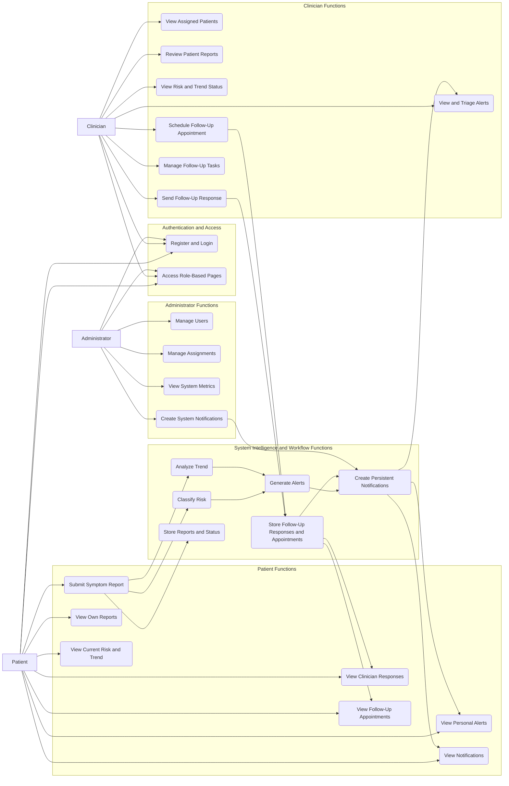

# 4.3.1 Use-Case Diagram

This version is kept simple for a white page and printing. The Mermaid below uses a flowchart layout so it renders more reliably than Mermaid's newer `usecase` syntax.

```mermaid
flowchart LR
    Patient[Patient]
    Clinician[Clinician]
    Admin[Administrator]

    subgraph Auth["Authentication and Access"]
        UC1(Register and Login)
        UC2(Access Role-Based Pages)
    end

    subgraph PatientFunctions["Patient Functions"]
        UC3(Submit Symptom Report)
        UC4(View Own Reports)
        UC5(View Current Risk and Trend)
        UC6(View Personal Alerts)
        UC7(View Clinician Responses)
        UC8(View Follow-Up Appointments)
        UC9(View Notifications)
    end

    subgraph ClinicianFunctions["Clinician Functions"]
        UC10(View Assigned Patients)
        UC11(Review Patient Reports)
        UC12(View Risk and Trend Status)
        UC13(View and Triage Alerts)
        UC14(Send Follow-Up Response)
        UC15(Schedule Follow-Up Appointment)
        UC16(Manage Follow-Up Tasks)
    end

    subgraph AdminFunctions["Administrator Functions"]
        UC17(Manage Users)
        UC18(Manage Assignments)
        UC19(View System Metrics)
        UC20(Create System Notifications)
    end

    subgraph SystemFunctions["System Intelligence and Workflow Functions"]
        UC21(Classify Risk)
        UC22(Analyze Trend)
        UC23(Generate Alerts)
        UC24(Store Reports and Status)
        UC25(Create Persistent Notifications)
        UC26(Store Follow-Up Responses and Appointments)
    end

    Patient --> UC1
    Patient --> UC2
    Patient --> UC3
    Patient --> UC4
    Patient --> UC5
    Patient --> UC6
    Patient --> UC7
    Patient --> UC8
    Patient --> UC9

    Clinician --> UC1
    Clinician --> UC2
    Clinician --> UC10
    Clinician --> UC11
    Clinician --> UC12
    Clinician --> UC13
    Clinician --> UC14
    Clinician --> UC15
    Clinician --> UC16

    Admin --> UC1
    Admin --> UC2
    Admin --> UC17
    Admin --> UC18
    Admin --> UC19
    Admin --> UC20

    UC3 --> UC21
    UC3 --> UC22
    UC21 --> UC23
    UC22 --> UC23
    UC3 --> UC24
    UC23 --> UC25
    UC25 --> UC6
    UC25 --> UC9
    UC25 --> UC13
    UC14 --> UC26
    UC15 --> UC26
    UC26 --> UC25
    UC26 --> UC7
    UC26 --> UC8
    UC20 --> UC25
```
