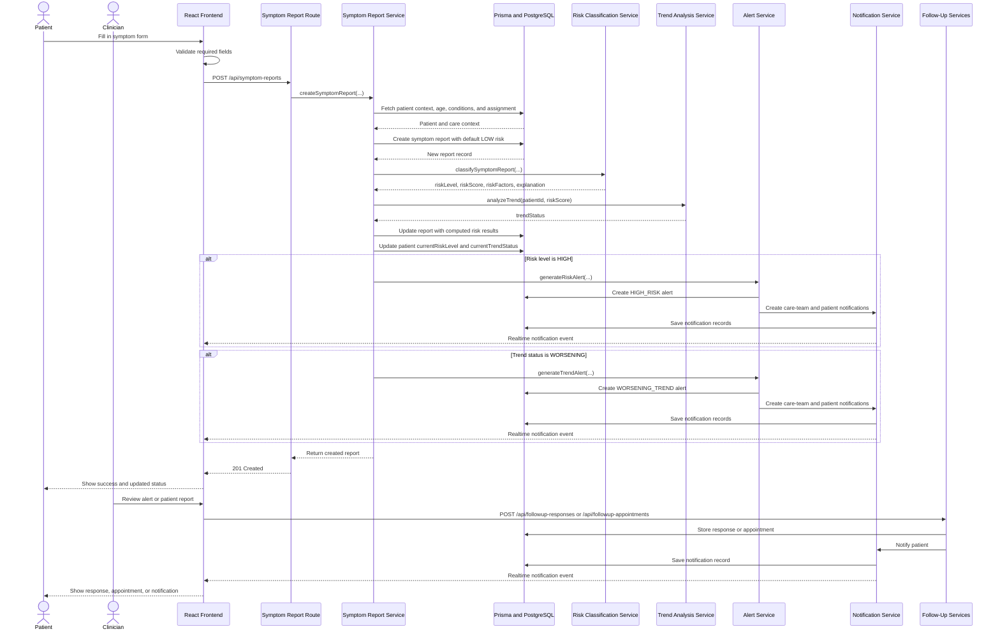

# 4.3.2 Sequence Diagram

This sequence diagram shows the main flow when a patient submits a symptom report, the backend runs the intelligence pipeline, and the follow-up workflow continues through clinician actions and patient notifications.

