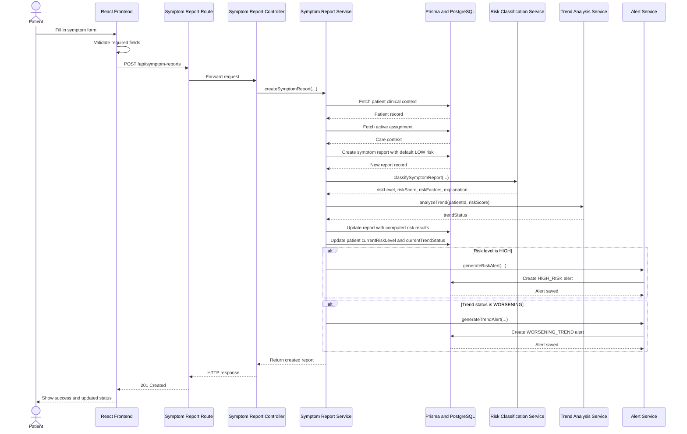

# 4.3.2 Sequence Diagram

This sequence diagram shows the main flow when a patient submits a symptom report and the backend runs the intelligence pipeline.

```mermaid
sequenceDiagram
    actor Patient
    participant Frontend as React Frontend
    participant Route as Symptom Report Route
    participant Controller as Symptom Report Controller
    participant Service as Symptom Report Service
    participant DB as Prisma and PostgreSQL
    participant Risk as Risk Classification Service
    participant Trend as Trend Analysis Service
    participant Alert as Alert Service

    Patient->>Frontend: Fill in symptom form
    Frontend->>Frontend: Validate required fields
    Frontend->>Route: POST /api/symptom-reports
    Route->>Controller: Forward request
    Controller->>Service: createSymptomReport(...)

    Service->>DB: Fetch patient clinical context
    DB-->>Service: Patient record

    Service->>DB: Fetch active assignment
    DB-->>Service: Care context

    Service->>DB: Create symptom report with default LOW risk
    DB-->>Service: New report record

    Service->>Risk: classifySymptomReport(...)
    Risk-->>Service: riskLevel, riskScore, riskFactors, explanation

    Service->>Trend: analyzeTrend(patientId, riskScore)
    Trend-->>Service: trendStatus

    Service->>DB: Update report with computed risk results
    Service->>DB: Update patient currentRiskLevel and currentTrendStatus

    alt Risk level is HIGH
        Service->>Alert: generateRiskAlert(...)
        Alert->>DB: Create HIGH_RISK alert
        DB-->>Alert: Alert saved
    end

    alt Trend status is WORSENING
        Service->>Alert: generateTrendAlert(...)
        Alert->>DB: Create WORSENING_TREND alert
        DB-->>Alert: Alert saved
    end

    Service-->>Controller: Return created report
    Controller-->>Route: HTTP response
    Route-->>Frontend: 201 Created
    Frontend-->>Patient: Show success and updated status
```
