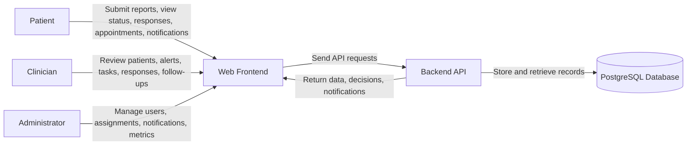
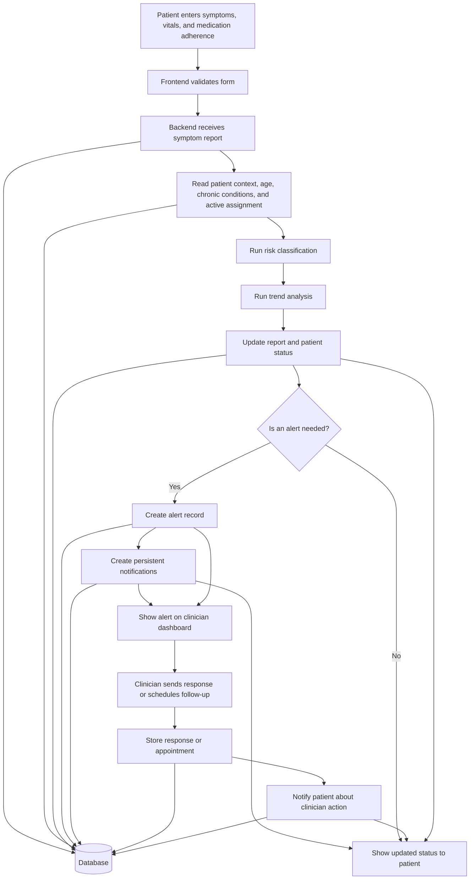

# 4.4.1 Context Diagram and DFD Diagram

This file contains two diagrams: a context diagram and a simple data flow diagram. Both are arranged to stay readable on a white printed page.

## Context Diagram

## Data Flow Diagram

