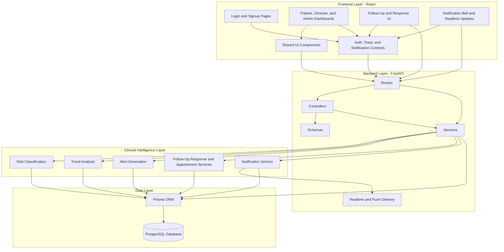

# 4.4.2 Architectural Design

This diagram presents the system as connected layers so it can be inserted directly into Chapter 4.

```mermaid
flowchart TB
    subgraph ClientLayer["Frontend Layer - React"]
        Login[Login and Signup Pages]
        Dashboards[Patient, Clinician, and Admin Dashboards]
        FollowUpUI[Follow-Up and Response UI]
        NotificationUI[Notification Bell and Realtime Updates]
        UIComponents[Shared UI Components]
        Contexts[Auth, Toast, and Notification Contexts]
    end

    subgraph APILayer["Backend Layer - FastAPI"]
        Routes[Routes]
        Controllers[Controllers]
        Schemas[Schemas]
        Services[Services]
        Realtime[Realtime and Push Delivery]
    end

    subgraph IntelligenceLayer["Clinical Intelligence Layer"]
        RiskService[Risk Classification]
        TrendService[Trend Analysis]
        AlertService[Alert Generation]
        FollowUpService[Follow-Up Response and Appointment Services]
        NotificationService[Notification Service]
    end

    subgraph DataLayer["Data Layer"]
        Prisma[Prisma ORM]
        Database[(PostgreSQL Database)]
    end

    Login --> Contexts
    Dashboards --> UIComponents
    Dashboards --> Contexts
    FollowUpUI --> Contexts
    NotificationUI --> Contexts

    Contexts --> Routes
    UIComponents --> Routes
    FollowUpUI --> Routes
    NotificationUI --> Routes

    Routes --> Controllers
    Routes --> Services
    Controllers --> Schemas
    Controllers --> Services

    Services --> RiskService
    Services --> TrendService
    Services --> AlertService
    Services --> FollowUpService
    Services --> NotificationService
    NotificationService --> Realtime

    Services --> Prisma
    RiskService --> Prisma
    TrendService --> Prisma
    AlertService --> Prisma
    FollowUpService --> Prisma
    NotificationService --> Prisma
    Prisma --> Database
```
