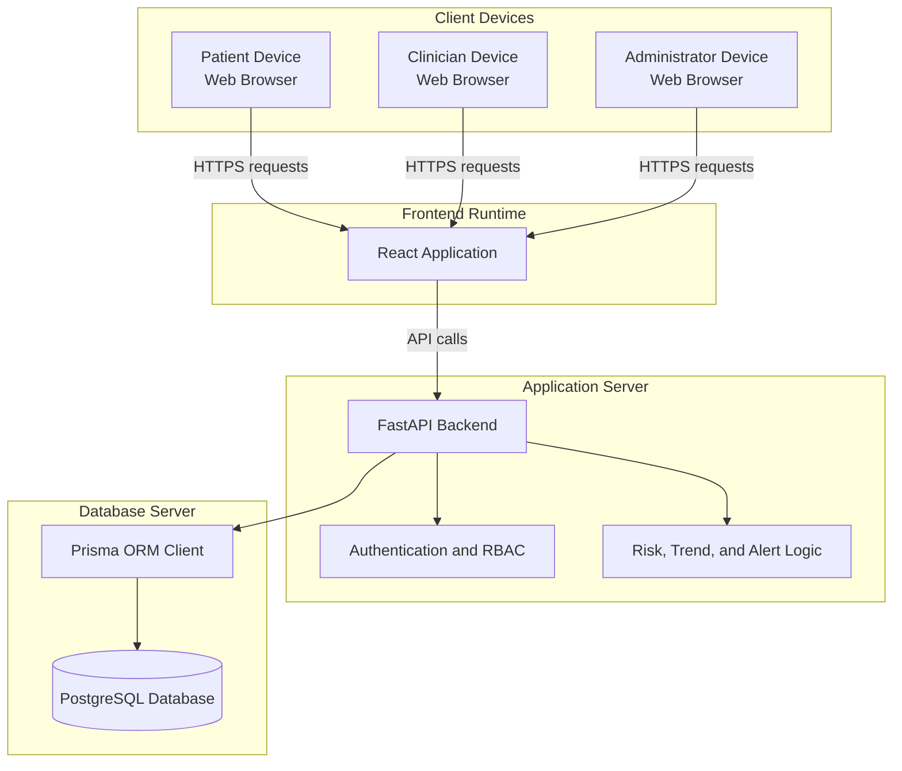

# 4.4.3 Physical Design

This diagram shows the physical deployment view of the telemedicine platform in a simple form suitable for a white page and printing.

```mermaid
flowchart TB
    subgraph ClientDevices["Client Devices"]
        PatientDevice[Patient Device<br/>Web Browser]
        ClinicianDevice[Clinician Device<br/>Web Browser]
        AdminDevice[Administrator Device<br/>Web Browser]
    end

    subgraph FrontendHost["Frontend Runtime"]
        ReactApp[React Application]
    end

    subgraph BackendHost["Application Server"]
        FastAPI[FastAPI Backend]
        AuthLogic[Authentication and RBAC]
        ClinicalLogic[Risk, Trend, and Alert Logic]
    end

    subgraph DatabaseHost["Database Server"]
        Prisma[Prisma ORM Client]
        PostgreSQL[(PostgreSQL Database)]
    end

    PatientDevice -->|HTTPS requests| ReactApp
    ClinicianDevice -->|HTTPS requests| ReactApp
    AdminDevice -->|HTTPS requests| ReactApp

    ReactApp -->|API calls| FastAPI
    FastAPI --> AuthLogic
    FastAPI --> ClinicalLogic
    FastAPI --> Prisma
    Prisma --> PostgreSQL
```
