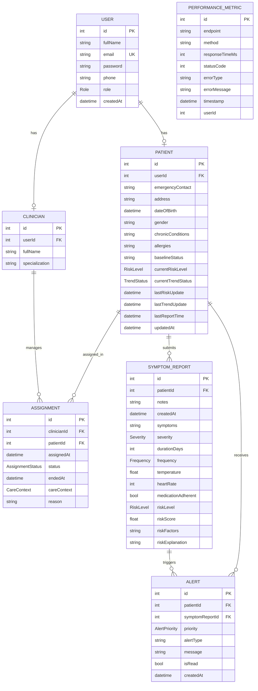

# 4.4.4 Database Design

This section presents the entity relationship diagram and the logical design of the main database tables used by the telemedicine system. The design is based on the actual `schema.prisma` file in the project, which defines the entities, attributes, keys, and relationships implemented in the PostgreSQL database.

## Entity Relationship Diagram

The ER diagram shows how the core entities are connected. The system starts from the `User` table because every patient and clinician account is first created as a user. A patient can submit many symptom reports, can receive many alerts, and can be linked to clinicians through assignments. Each alert is tied to a symptom report so that clinicians can trace the warning back to the report that triggered it.

## Logical Design of Tables

The logical design describes the structure of each table, its important attributes, and its role in the system.

### 1. User Table

The `User` table stores the common account details used for authentication and role-based access control. It is the parent table for both patients and clinicians.

| Field | Data Type | Key/Constraint | Description |
|---|---|---|---|
| `id` | Int | Primary Key | Unique identifier for each user |
| `fullName` | String | Nullable | Full name of the user |
| `email` | String | Unique | Email used for login |
| `password` | String | Required | Hashed password |
| `phone` | String | Nullable | Contact number |
| `role` | Role | Default `PATIENT` | Defines whether the user is a patient, clinician, or admin |
| `createdAt` | DateTime | Default `now()` | Date and time the account was created |

### 2. Patient Table

The `Patient` table stores patient profile data and current monitoring status. It extends the `User` table through a one-to-one relationship.

| Field | Data Type | Key/Constraint | Description |
|---|---|---|---|
| `id` | Int | Primary Key | Unique identifier for each patient record |
| `userId` | Int | Foreign Key, Unique | Links the patient to one user account |
| `emergencyContact` | String | Required | Emergency contact information |
| `address` | String | Nullable | Home address |
| `dateOfBirth` | DateTime | Required | Patient date of birth |
| `gender` | String | Required | Patient gender |
| `updatedAt` | DateTime | Auto-updated | Last profile update time |
| `chronicConditions` | String | Nullable | Stored list of long-term conditions |
| `allergies` | String | Nullable | Stored list of allergies |
| `baselineStatus` | String | Nullable | Baseline health status |
| `currentRiskLevel` | RiskLevel | Default `LOW` | Current patient risk level |
| `currentTrendStatus` | TrendStatus | Default `STABLE` | Current patient health trend |
| `lastRiskUpdate` | DateTime | Nullable | Last time risk was recalculated |
| `lastTrendUpdate` | DateTime | Nullable | Last time trend was updated |
| `lastReportTime` | DateTime | Nullable | Last symptom report submission time |

### 3. Clinician Table

The `Clinician` table stores healthcare worker information. It also extends the `User` table using a one-to-one relationship.

| Field | Data Type | Key/Constraint | Description |
|---|---|---|---|
| `id` | Int | Primary Key | Unique identifier for each clinician record |
| `userId` | Int | Foreign Key, Unique | Links the clinician to one user account |
| `fullName` | String | Required | Clinician full name |
| `specialization` | String | Required | Area of medical specialization |

### 4. Assignment Table

The `Assignment` table resolves the relationship between patients and clinicians. It shows which clinician is responsible for which patient and under what care context.

| Field | Data Type | Key/Constraint | Description |
|---|---|---|---|
| `id` | Int | Primary Key | Unique assignment identifier |
| `clinicianId` | Int | Foreign Key | Links to the clinician table |
| `patientId` | Int | Foreign Key | Links to the patient table |
| `assignedAt` | DateTime | Default `now()` | Date and time of assignment |
| `status` | AssignmentStatus | Default `ACTIVE` | Current assignment state |
| `endedAt` | DateTime | Nullable | End date when assignment becomes inactive |
| `careContext` | CareContext | Default `GENERAL_REVIEW` | Reason or monitoring category for the assignment |
| `reason` | String | Nullable | Extra notes about the assignment |

### 5. SymptomReport Table

The `SymptomReport` table is the main transactional table in the system. It stores the symptoms and vital signs submitted by patients and also stores the risk analysis output generated by the backend.

| Field | Data Type | Key/Constraint | Description |
|---|---|---|---|
| `id` | Int | Primary Key | Unique report identifier |
| `patientId` | Int | Foreign Key | Links the report to a patient |
| `notes` | String | Nullable | Optional patient notes |
| `createdAt` | DateTime | Default `now()` | Time the report was created |
| `symptoms` | String | Default `"[]"` | Stored list of symptom identifiers |
| `severity` | Severity | Default `MILD` | Overall symptom severity |
| `durationDays` | Int | Default `1` | Number of days symptoms have lasted |
| `frequency` | Frequency | Default `FIRST_TIME` | Whether symptoms are first-time, recurring, or chronic |
| `temperature` | Float | Nullable | Patient body temperature |
| `heartRate` | Int | Nullable | Patient heart rate |
| `medicationAdherent` | Boolean | Nullable | Indicates whether medication is being taken correctly |
| `riskLevel` | RiskLevel | Default `LOW` | Calculated risk category |
| `riskScore` | Float | Default `0.0` | Numerical score produced by the risk logic |
| `riskFactors` | String | Nullable | Stored explanation of scoring components |
| `riskExplanation` | String | Nullable | Human-readable explanation of the result |

### 6. Alert Table

The `Alert` table stores warning messages produced by the system after symptom reports are analyzed. These alerts help clinicians identify patients who need attention.

| Field | Data Type | Key/Constraint | Description |
|---|---|---|---|
| `id` | Int | Primary Key | Unique alert identifier |
| `patientId` | Int | Foreign Key | Links alert to the patient |
| `symptomReportId` | Int | Foreign Key | Links alert to the triggering report |
| `priority` | AlertPriority | Required | Alert priority level |
| `alertType` | String | Required | Type of alert generated |
| `message` | String | Required | Alert message shown to the clinician |
| `isRead` | Boolean | Default `false` | Indicates whether the alert has been viewed |
| `createdAt` | DateTime | Default `now()` | Time the alert was created |

### 7. PerformanceMetric Table

The `PerformanceMetric` table is used for monitoring system performance. It records API response behavior and runtime issues for evaluation and maintenance purposes.

| Field | Data Type | Key/Constraint | Description |
|---|---|---|---|
| `id` | Int | Primary Key | Unique metric identifier |
| `endpoint` | String | Required | API endpoint being measured |
| `method` | String | Required | HTTP method used |
| `responseTimeMs` | Int | Required | Response time in milliseconds |
| `statusCode` | Int | Required | HTTP response status code |
| `errorType` | String | Nullable | Category of error if one occurred |
| `errorMessage` | String | Nullable | Error details if present |
| `timestamp` | DateTime | Default `now()` | Time the metric was recorded |
| `userId` | Int | Nullable | Optional reference to the user involved in the request |

## Relationship Summary

The logical database design supports the telemedicine workflow by separating account data, patient clinical data, monitoring transactions, and generated alerts into related tables. The `User` table handles authentication and identity, the `Patient` and `Clinician` tables store role-specific records, the `Assignment` table manages care relationships, the `SymptomReport` table stores patient submissions and analysis outputs, and the `Alert` table records warning notifications. This structure reduces redundancy and makes it easier to query patient history, clinician assignments, and system-generated decisions.
