# 4.4.4 Database Design

This section presents the entity relationship diagram and the logical design of the main database tables used by the telemedicine system. The design is based on the actual `schema.prisma` file in the project, which defines the entities, attributes, keys, and relationships implemented in the PostgreSQL database.

## Entity Relationship Diagram

The ER diagram shows how accounts, patients, clinicians, symptom reports, alerts, follow-up actions, notifications, tasks, push subscriptions, audit logs, and performance metrics are connected. The new follow-up tables extend the earlier monitoring workflow by allowing clinicians to respond to a report and schedule follow-up appointments after reviewing alerts or patient status.

```mermaid
erDiagram
    USER ||--o| PATIENT : has
    USER ||--o| CLINICIAN : has
    USER ||--o{ NOTIFICATION : receives
    USER ||--o{ PUSH_SUBSCRIPTION : owns
    USER ||--o{ AUDIT_LOG : creates
    USER ||--o{ ALERT : acts_on

    PATIENT ||--o{ ASSIGNMENT : assigned_in
    CLINICIAN ||--o{ ASSIGNMENT : manages
    PATIENT ||--o{ SYMPTOM_REPORT : submits
    PATIENT ||--o{ ALERT : receives
    CLINICIAN ||--o{ ALERT : assigned
    SYMPTOM_REPORT ||--o{ ALERT : triggers

    PATIENT ||--o{ TASK : has
    CLINICIAN ||--o{ TASK : assigned
    ALERT ||--o{ TASK : creates

    SYMPTOM_REPORT ||--o{ FOLLOW_UP_RESPONSE : receives
    PATIENT ||--o{ FOLLOW_UP_RESPONSE : has
    CLINICIAN ||--o{ FOLLOW_UP_RESPONSE : writes

    PATIENT ||--o{ FOLLOW_UP_APPOINTMENT : has
    CLINICIAN ||--o{ FOLLOW_UP_APPOINTMENT : schedules

    USER {
        int id PK
        string fullName
        string email UK
        string password
        string phone
        Role role
        datetime createdAt
    }

    PATIENT {
        int id PK
        int userId FK
        string emergencyContact
        string address
        datetime dateOfBirth
        string gender
        string chronicConditions
        string allergies
        string baselineStatus
        RiskLevel currentRiskLevel
        TrendStatus currentTrendStatus
        datetime lastRiskUpdate
        datetime lastTrendUpdate
        datetime lastReportTime
        datetime updatedAt
    }

    CLINICIAN {
        int id PK
        int userId FK
        string fullName
        string specialization
    }

    ASSIGNMENT {
        int id PK
        int clinicianId FK
        int patientId FK
        datetime assignedAt
        AssignmentStatus status
        datetime endedAt
        CareContext careContext
        string reason
    }

    SYMPTOM_REPORT {
        int id PK
        int patientId FK
        string notes
        datetime createdAt
        string symptoms
        Severity severity
        int durationDays
        Frequency frequency
        float temperature
        int heartRate
        bool medicationAdherent
        RiskLevel riskLevel
        float riskScore
        string riskFactors
        string riskExplanation
    }

    ALERT {
        int id PK
        int patientId FK
        int symptomReportId FK
        int assignedToClinicianId FK
        int lastActionByUserId FK
        AlertPriority priority
        string alertType
        string message
        bool isRead
        AlertStatus status
        string triageAction
        string resolutionNote
        datetime createdAt
        datetime updatedAt
    }

    TASK {
        int id PK
        int patientId FK
        int assignedClinicianId FK
        int createdFromAlertId FK
        string title
        string description
        TaskStatus status
        TaskPriority priority
        datetime dueAt
        datetime createdAt
        datetime updatedAt
    }

    FOLLOW_UP_RESPONSE {
        int id PK
        int symptomReportId FK
        int clinicianId FK
        int patientId FK
        string message
        bool actionRequired
        datetime createdAt
    }

    FOLLOW_UP_APPOINTMENT {
        int id PK
        int patientId FK
        int clinicianId FK
        datetime scheduledAt
        string reason
        string status
        datetime createdAt
        datetime updatedAt
    }

    NOTIFICATION {
        int id PK
        int userId FK
        string title
        string message
        string type
        bool isRead
        string link
        datetime createdAt
    }

    PUSH_SUBSCRIPTION {
        int id PK
        int userId FK
        string endpoint
        string p256dh
        string auth
        datetime createdAt
    }

    AUDIT_LOG {
        int id PK
        int userId FK
        string action
        string entityType
        int entityId
        string metadata
        datetime createdAt
    }

    PERFORMANCE_METRIC {
        int id PK
        string endpoint
        string method
        int responseTimeMs
        int statusCode
        string errorType
        string errorMessage
        datetime timestamp
        int userId
    }
```

## Logical Design of Tables

The logical design describes the structure of each table, its important attributes, and its role in the system.

### 1. User Table

The `User` table stores the common account details used for authentication and role-based access control. It is the parent table for patient and clinician profiles and also owns persistent notification, push subscription, and audit records.

| Field | Data Type | Key/Constraint | Description |
|---|---|---|---|
| `id` | Int | Primary Key | Unique identifier for each user |
| `fullName` | String | Nullable | Full name of the user |
| `email` | String | Unique | Email used for login |
| `password` | String | Required | Hashed password |
| `phone` | String | Nullable | Contact number |
| `role` | Role | Default `PATIENT` | Defines whether the user is a patient, clinician, or admin |
| `createdAt` | DateTime | Default `now()` | Date and time the account was created |

### 2. Patient Table

The `Patient` table stores patient profile data and current monitoring status. It extends the `User` table through a one-to-one relationship.

| Field | Data Type | Key/Constraint | Description |
|---|---|---|---|
| `id` | Int | Primary Key | Unique identifier for each patient record |
| `userId` | Int | Foreign Key, Unique | Links the patient to one user account |
| `emergencyContact` | String | Required | Emergency contact information |
| `address` | String | Nullable | Home address |
| `dateOfBirth` | DateTime | Required | Patient date of birth, also used by the risk engine for age context |
| `gender` | String | Required | Patient gender |
| `updatedAt` | DateTime | Auto-updated | Last profile update time |
| `chronicConditions` | String | Nullable | Stored list of long-term conditions |
| `allergies` | String | Nullable | Stored list of allergies |
| `baselineStatus` | String | Nullable | Baseline health status |
| `currentRiskLevel` | RiskLevel | Default `LOW` | Current patient risk level |
| `currentTrendStatus` | TrendStatus | Default `STABLE` | Current patient health trend |
| `lastRiskUpdate` | DateTime | Nullable | Last time risk was recalculated |
| `lastTrendUpdate` | DateTime | Nullable | Last time trend was updated |
| `lastReportTime` | DateTime | Nullable | Last symptom report submission time |

### 3. Clinician Table

The `Clinician` table stores healthcare worker information. It also extends the `User` table using a one-to-one relationship.

| Field | Data Type | Key/Constraint | Description |
|---|---|---|---|
| `id` | Int | Primary Key | Unique identifier for each clinician record |
| `userId` | Int | Foreign Key, Unique | Links the clinician to one user account |
| `fullName` | String | Required | Clinician full name |
| `specialization` | String | Required | Area of medical specialization |

### 4. Assignment Table

The `Assignment` table resolves the relationship between patients and clinicians. It shows which clinician is responsible for which patient and under what care context.

| Field | Data Type | Key/Constraint | Description |
|---|---|---|---|
| `id` | Int | Primary Key | Unique assignment identifier |
| `clinicianId` | Int | Foreign Key | Links to the clinician table |
| `patientId` | Int | Foreign Key | Links to the patient table |
| `assignedAt` | DateTime | Default `now()` | Date and time of assignment |
| `status` | AssignmentStatus | Default `ACTIVE` | Current assignment state |
| `endedAt` | DateTime | Nullable | End date when assignment becomes inactive |
| `careContext` | CareContext | Default `GENERAL_REVIEW` | Reason or monitoring category for the assignment |
| `reason` | String | Nullable | Extra notes about the assignment |

### 5. SymptomReport Table

The `SymptomReport` table is the main transactional table in the system. It stores symptoms, vital signs, medication adherence, and the risk analysis output generated by the backend.

| Field | Data Type | Key/Constraint | Description |
|---|---|---|---|
| `id` | Int | Primary Key | Unique report identifier |
| `patientId` | Int | Foreign Key | Links the report to a patient |
| `notes` | String | Nullable | Optional patient notes |
| `createdAt` | DateTime | Default `now()` | Time the report was created |
| `symptoms` | String | Default `"[]"` | Stored list of symptom identifiers |
| `severity` | Severity | Default `MILD` | Overall symptom severity |
| `durationDays` | Int | Default `1` | Number of days symptoms have lasted |
| `frequency` | Frequency | Default `FIRST_TIME` | Whether symptoms are first-time, recurring, or chronic |
| `temperature` | Float | Nullable | Patient body temperature |
| `heartRate` | Int | Nullable | Patient heart rate |
| `medicationAdherent` | Boolean | Nullable | Indicates whether medication is being taken correctly |
| `riskLevel` | RiskLevel | Default `LOW` | Calculated risk category |
| `riskScore` | Float | Default `0.0` | Numerical score produced by the risk logic |
| `riskFactors` | String | Nullable | Stored explanation of scoring components |
| `riskExplanation` | String | Nullable | Human-readable explanation of the result |

### 6. Alert Table

The `Alert` table stores warning messages produced by the system after symptom reports are analyzed. Alerts can be assigned to clinicians and can be acted on through triage and follow-up workflows.

| Field | Data Type | Key/Constraint | Description |
|---|---|---|---|
| `id` | Int | Primary Key | Unique alert identifier |
| `patientId` | Int | Foreign Key | Links alert to the patient |
| `symptomReportId` | Int | Foreign Key | Links alert to the triggering report |
| `assignedToClinicianId` | Int | Nullable FK | Clinician responsible for the alert |
| `lastActionByUserId` | Int | Nullable FK | User who last changed triage status |
| `priority` | AlertPriority | Required | Alert priority level |
| `alertType` | String | Required | Type of alert generated |
| `message` | String | Required | Alert message shown to the clinician |
| `isRead` | Boolean | Default `false` | Indicates whether the alert has been viewed |
| `status` | AlertStatus | Default `NEW` | Current alert workflow state |
| `triageAction` | String | Nullable | Follow-up action chosen by staff |
| `resolutionNote` | String | Nullable | Note explaining the outcome |
| `createdAt` | DateTime | Default `now()` | Time the alert was created |
| `updatedAt` | DateTime | Auto-updated | Last time the alert was changed |

### 7. Task Table

The `Task` table stores clinician work items, including tasks created from alerts.

| Field | Data Type | Key/Constraint | Description |
|---|---|---|---|
| `id` | Int | Primary Key | Unique task identifier |
| `patientId` | Int | Foreign Key | Patient the task belongs to |
| `assignedClinicianId` | Int | Nullable FK | Clinician responsible for the task |
| `createdFromAlertId` | Int | Nullable FK | Alert that created the task |
| `title` | String | Required | Short task title |
| `description` | String | Nullable | Extra task detail |
| `status` | TaskStatus | Default `OPEN` | Current task state |
| `priority` | TaskPriority | Default `MEDIUM` | Task priority |
| `dueAt` | DateTime | Nullable | Due date/time |
| `createdAt` | DateTime | Default `now()` | Time the task was created |
| `updatedAt` | DateTime | Auto-updated | Last time the task changed |

### 8. FollowUpResponse Table

The `FollowUpResponse` table stores a clinician response to a specific symptom report. It lets a patient see guidance from their clinician after a report has been reviewed.

| Field | Data Type | Key/Constraint | Description |
|---|---|---|---|
| `id` | Int | Primary Key | Unique response identifier |
| `symptomReportId` | Int | Foreign Key | Report the clinician responded to |
| `clinicianId` | Int | Foreign Key | Clinician who wrote the response |
| `patientId` | Int | Foreign Key | Patient receiving the response |
| `message` | String | Required | Clinician guidance message |
| `actionRequired` | Boolean | Default `false` | Shows whether the patient must take action |
| `createdAt` | DateTime | Default `now()` | Time the response was created |

### 9. FollowUpAppointment Table

The `FollowUpAppointment` table stores scheduled follow-up appointments between clinicians and patients.

| Field | Data Type | Key/Constraint | Description |
|---|---|---|---|
| `id` | Int | Primary Key | Unique appointment identifier |
| `patientId` | Int | Foreign Key | Patient attending the appointment |
| `clinicianId` | Int | Foreign Key | Clinician who scheduled or owns the appointment |
| `scheduledAt` | DateTime | Required | Appointment date and time |
| `reason` | String | Required | Reason for the follow-up |
| `status` | String | Default `SCHEDULED` | Appointment state: scheduled, completed, cancelled, or missed |
| `createdAt` | DateTime | Default `now()` | Time the appointment was created |
| `updatedAt` | DateTime | Auto-updated | Last time the appointment changed |

### 10. Notification Table

The `Notification` table stores in-app notifications and reminders for users. It is used for alerts, follow-up schedules, clinician responses, medication check-ins, and system messages.

| Field | Data Type | Key/Constraint | Description |
|---|---|---|---|
| `id` | Int | Primary Key | Unique notification identifier |
| `userId` | Int | Foreign Key | User receiving the notification |
| `title` | String | Required | Notification title |
| `message` | String | Required | Notification body |
| `type` | String | Required | Notification category |
| `isRead` | Boolean | Default `false` | Whether the user has read it |
| `link` | String | Nullable | Optional frontend path for deep-linking |
| `createdAt` | DateTime | Default `now()` | Time the notification was created |

### 11. Supporting Tables

`PushSubscription` stores browser push subscription details, `AuditLog` records important user actions, and `PerformanceMetric` records API performance data.

## Relationship Summary

The logical database design supports the telemedicine workflow by separating account data, patient clinical data, monitoring transactions, generated alerts, clinician follow-up actions, and user notifications into related tables. The `User` table handles authentication and identity, the `Patient` and `Clinician` tables store role-specific records, the `Assignment` table manages care relationships, the `SymptomReport` table stores patient submissions and analysis outputs, the `Alert` table records warnings, and the follow-up and notification tables close the loop between clinician review and patient-facing guidance.
