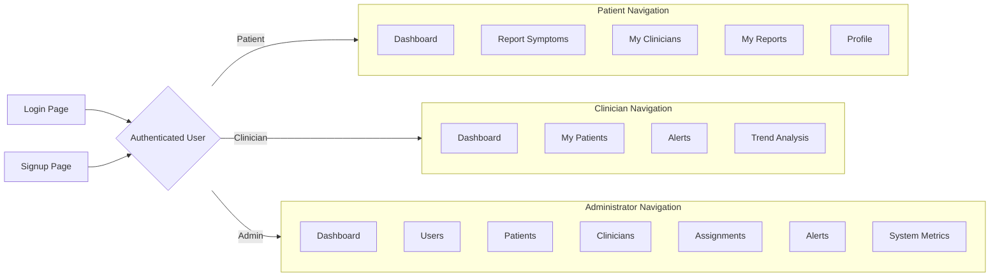
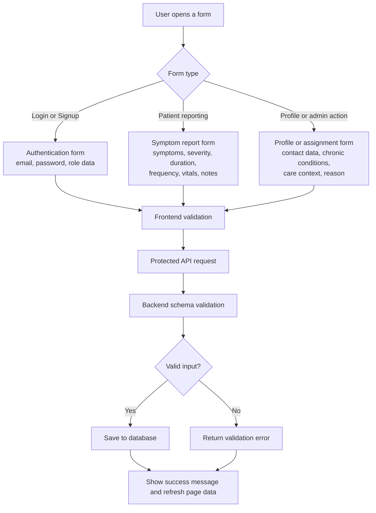

# 4.4.5 Interface Design

This file contains three simple interface design diagrams based on the actual frontend structure in the project.

## 4.4.5.1 Menu Design

## 4.4.5.2 Input Design

## 4.4.5.3 Output Design

```mermaid
flowchart TB
    API[Backend API Response]

    subgraph PatientOutputs["Patient Outputs"]
        P1[Risk Level Card]
        P2[Trend Status Card]
        P3[Risk Score Chart]
        P4[Recent Reports List]
        P5[Assigned Clinicians View]
    end

    subgraph ClinicianOutputs["Clinician Outputs"]
        C1[Prioritized Patient Table]
        C2[Alert List]
        C3[Trend Detail Panel]
        C4[Latest Report Explanation]
    end

    subgraph AdminOutputs["Administrator Outputs"]
        A1[System Statistics Cards]
        A2[Users Table]
        A3[Assignments Table]
        A4[Alerts View]
        A5[Metrics and Accuracy Panels]
    end

    API --> P1
    API --> P2
    API --> P3
    API --> P4
    API --> P5

    API --> C1
    API --> C2
    API --> C3
    API --> C4

    API --> A1
    API --> A2
    API --> A3
    API --> A4
    API --> A5
```

