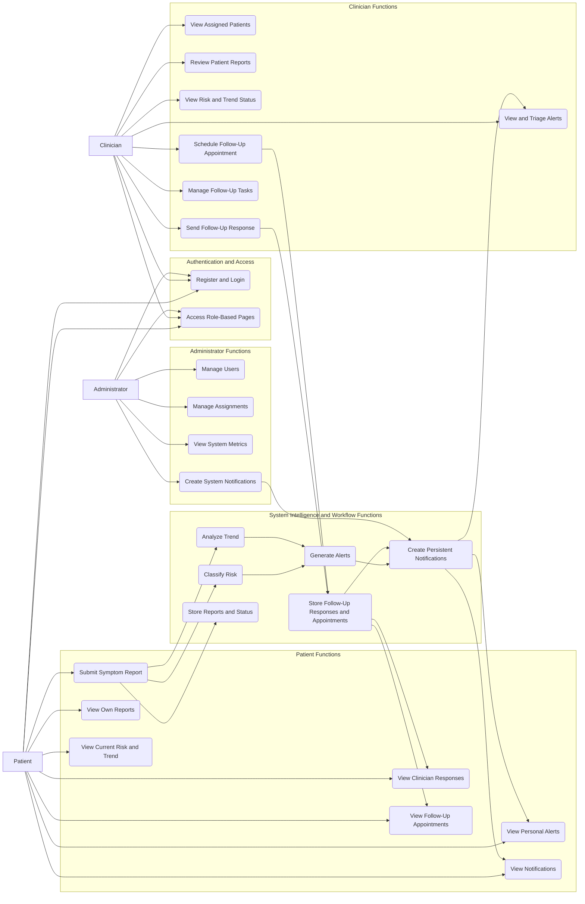
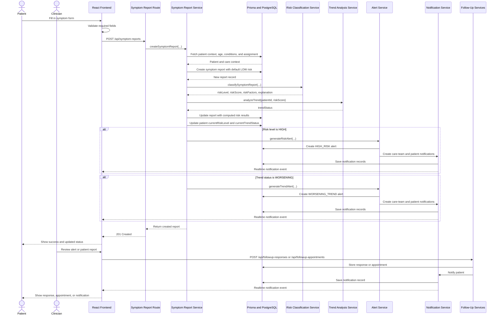
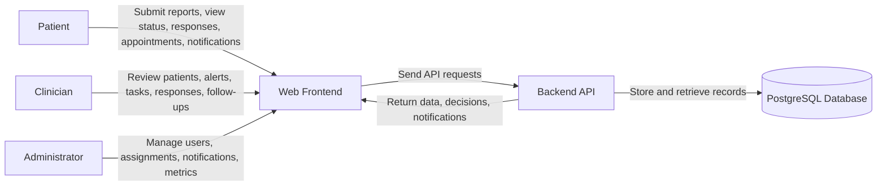
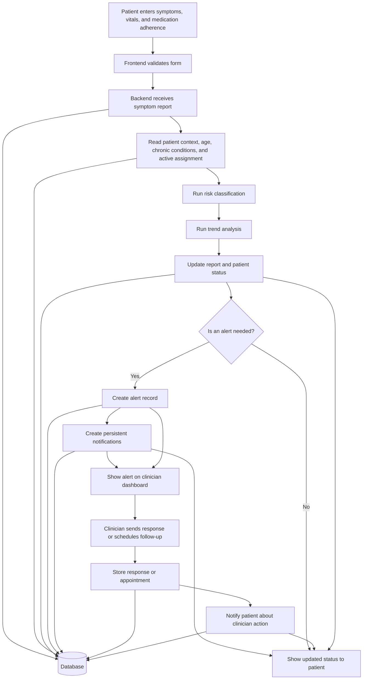
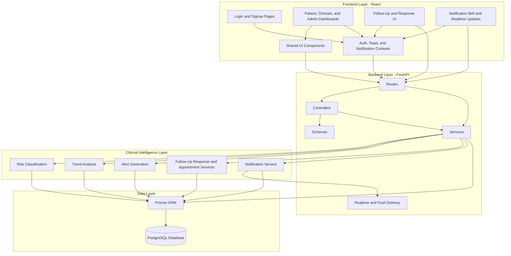
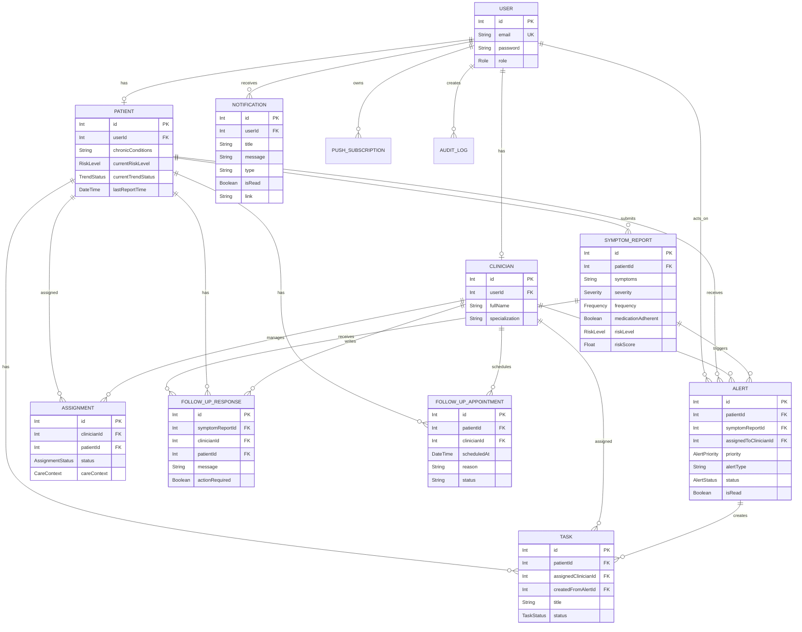

# CHAPTER 4: ANALYSIS AND DESIGN

## 4.1 Introduction

This chapter explains how the telemedicine platform was analysed and designed before and during implementation. It describes the problem domain, the main user requirements, the system components, and the overall architecture. Diagrams are included to show how the system works from a user and technical perspective.

The system is a web-based remote symptom monitoring platform. Patients submit symptom reports through a web interface, and clinicians review patient status, trends, alerts, follow-up appointments, and responses through a dashboard. The backend processes symptom reports using a rule-based alert engine, stores the results in a database, creates alerts when needed, and supports persistent in-app notifications.

## 4.2 Detailed Analysis of the Problem Domain and User Requirements

### 4.2.1 Functional Requirements

The following functional requirements describe what the system must do.

**Authentication and Access Control**

- The system must allow users to register and log in.
- The system must support role-based access (Patient, Clinician, Admin).
- The system must protect pages and endpoints so users only see what they are allowed to see.

**Patient Features**

- A patient must be able to submit a symptom report (symptoms, severity, duration, frequency, medication adherence, and optional vitals).
- A patient must be able to view their own submitted reports and current status (risk and trend).
- A patient must be able to view alerts related to their reports.
- A patient must be able to view clinician responses and scheduled follow-up appointments.
- A patient must be able to view in-app notifications.

**Clinician Features**

- A clinician must be able to view assigned patients.
- A clinician must be able to review symptom reports submitted by assigned patients.
- A clinician must be able to view patient risk level and trend status.
- A clinician must be able to view alerts and mark or triage alerts.
- A clinician must be able to send follow-up responses to patients.
- A clinician must be able to schedule and update follow-up appointments.
- A clinician must be able to create or manage follow-up tasks.

**Administrator Features**

- An admin must be able to manage users.
- An admin must be able to manage patient-clinician assignments.
- An admin must be able to view system metrics.
- An admin must be able to create system notifications when needed.

**Clinical Intelligence and Workflow**

- The system must classify risk level for each symptom report using predefined rules.
- The system must analyse patient trends using recent report history.
- The system must use patient age, chronic conditions, care context, symptom severity, duration, frequency, vitals, and medication adherence when calculating risk.
- The system must generate alerts when risk is high or when trend is worsening.
- The system must store explanations with reports and alerts.
- The system must store notifications, follow-up responses, and follow-up appointments so patient care can continue after the first alert.

### 4.2.2 Non-functional Requirements

The following non-functional requirements describe quality and constraints.

**Usability**

- The system should be easy to use for patients and clinicians with clear dashboards and simple workflows.
- The interface should present risk/trend results clearly using badges, indicators, alerts, and notifications.

**Performance**

- The system should respond quickly to user actions such as submitting a symptom report and loading dashboards.
- Backend risk and trend processing should be fast enough to run during report submission.

**Security**

- The system should use secure authentication and role-based authorization.
- Sensitive clinical data should be processed on the server and only displayed to authorized users.

**Reliability**

- The system should store reports, alerts, follow-up records, appointments, notifications, and metrics reliably in the database.
- The system should handle invalid input gracefully and return clear errors.

**Maintainability**

- The system should be modular, with frontend components and backend services separated, so it is easier to update and extend.

## 4.3 Identification of System Components and Functionalities

The system can be understood as four main layers:

1. **Frontend layer**: Web user interface (Patient, Clinician, Admin dashboards, notification bell, and follow-up screens).
2. **Backend layer**: FastAPI routes, controllers, schemas, and services implementing business logic.
3. **Clinical intelligence and workflow layer**: Risk classification, trend analysis, alert generation, notification handling, and follow-up workflow.
4. **Data layer**: PostgreSQL database accessed using Prisma ORM.

### 4.3.1 Use-Case Diagram/s

The use-case diagram below shows the main user roles (Patient, Clinician, Administrator) and the core system actions.

### 4.3.2 Sequence Diagram

The sequence diagram below shows the typical flow when a patient submits a symptom report and the follow-up workflow continues after an alert.

## 4.4 System Architecture and Design Considerations

This section explains the high-level architecture and important design decisions.

### 4.4.1 Context Diagram and DFD Diagram

The context diagram below shows the system boundary and the main external users.

A simple data flow (DFD-style) view is shown below.

### 4.4.2 Architectural Design

The platform uses a typical web architecture with a separate frontend and backend:

- The **frontend** is a React application with pages for each role, shared components, a notification bell, and follow-up UI.
- The **backend** is a FastAPI application that exposes REST endpoints.
- The **service layer** contains the business logic, clinical rules, notification handling, and follow-up workflow.
- The **database** stores users, patients, clinicians, assignments, symptom reports, alerts, tasks, follow-up responses, follow-up appointments, notifications, push subscriptions, audit logs, and metrics.

High-level architecture overview:

### 4.4.3 Physical Design

The physical design describes where the system runs:

- The frontend runs in a web browser on the user device (patient/clinician/admin).
- The backend runs on a server or local machine during development.
- The database runs as a PostgreSQL instance.

In development, the frontend typically runs on a local dev server and sends requests to the backend API address, for example `http://localhost:8000`.

### 4.4.4 Database Design

The database design is defined using Prisma in `schema.prisma`. The main entities are:

- `User`: login identity and role (PATIENT, CLINICIAN, ADMIN)
- `Patient`: patient profile and current monitoring status
- `Clinician`: clinician profile
- `Assignment`: links a clinician to a patient and stores care context
- `SymptomReport`: structured symptom report plus computed risk results
- `Alert`: alert records triggered by high risk or worsening trends
- `Task`: follow-up work item, often created from an alert
- `FollowUpResponse`: clinician guidance linked to a symptom report
- `FollowUpAppointment`: scheduled patient-clinician follow-up
- `Notification`: persistent in-app notification record
- `PushSubscription`: browser push subscription data
- `AuditLog`: user activity record
- `PerformanceMetric`: system performance logs

Entity Relationship Diagram (based on `schema.prisma`):

### 4.4.5 Interface Design

#### 4.4.5.1 Menu Design

The frontend uses a sidebar navigation layout. Menu items change based on the user role:

- Patients see options related to submitting reports, viewing their status, viewing clinician responses, and viewing scheduled follow-ups.
- Clinicians see options related to patients, alerts, trends, tasks, responses, and follow-up appointments.
- Admins see options related to user management, assignments, alerts, and system monitoring.

#### 4.4.5.2 Input Design

Main inputs in the system include:

- Signup/login forms (email, password, role information).
- Symptom report form (symptoms, severity, duration, frequency, medication adherence, and optional vitals).
- Clinician/admin forms for creating assignments or updating user records.
- Clinician response forms for sending follow-up guidance.
- Follow-up appointment forms for scheduling patient appointments.

Input validation is done on both sides:

- frontend performs basic checks before sending data,
- backend validates using schemas and returns errors when input is invalid.

#### 4.4.5.3 Output Design

Main outputs in the system include:

- Dashboards showing patient risk level and trend status.
- Alerts list showing priority, type, workflow status, and clinical explanation.
- Follow-up cards showing appointments and clinician responses.
- In-app notifications shown through the notification bell.
- Charts/visuals for risk score over time.
- Basic metrics for system monitoring.

### 4.4.6 Security Design (If applicable)

The platform includes basic security design considerations.

#### 4.4.6.1 Physical Security

- In a real deployment, the server and database should run on secured infrastructure with limited physical access.

#### 4.4.6.2 Network Security

- The system should use HTTPS in production to protect data in transit.
- The backend should restrict cross-origin access to trusted frontend origins in production.

#### 4.4.6.3 Operational Security

- Authentication tokens should be managed securely and invalid sessions should be handled correctly.
- Access control should be enforced consistently for each role (patient/clinician/admin).
- Logs and metrics should not expose sensitive patient data.
- Notifications and follow-up records should only be visible to the correct patient, clinician, or administrator.

## 4.5 Conclusion

This chapter presented the analysis and design of the telemedicine platform. It described the main requirements, system components, and the full-stack architecture used to implement remote symptom monitoring. The included diagrams show how user actions flow through the frontend and backend, how the clinical intelligence layer produces risk and trend results, how alerts are generated and stored, and how clinician follow-up actions and notifications continue the care workflow after a report has been reviewed. The next phase of the project (implementation and results) builds directly on this design.
