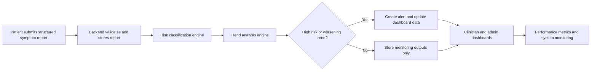

# CHAPTER 5: RESULTS

## 5.1 Introduction

This chapter presents the results of the telemedicine platform after development and functional evaluation. The aim of the project was to design and develop a secure web-based telemedicine follow-up and remote symptom monitoring platform. The main objectives were to support patient symptom reporting, medication adherence check-ins, clinician review, rule-based alerting, and system evaluation through functional, performance, and usability-related indicators.

The results presented in this chapter are based on the implemented prototype, the system features observed in the frontend and backend, and the testing and metrics support built into the project. Since this project is a software engineering prototype, the findings focus on what the system was able to do, how the core modules behaved, and whether the major objectives were achieved.

## 5.2 Presentation of Findings

The findings below are organized around the project objectives and the implemented system outputs. Because this is a prototype, the emphasis is on functional outcomes, rule behavior, and verification coverage rather than large-scale statistical measurement.

#### Table 5.1: Summary of Findings Against the Project Objectives

| Project objective | Evidence in the prototype | Finding |
| --- | --- | --- |
| Support patient symptom reporting | Structured symptom reports were submitted through the web interface and persisted in the database | The core reporting workflow was implemented successfully |
| Classify clinical risk in an explainable way | The backend computes a deterministic risk score and stores a human-readable explanation | The system can translate symptom data into LOW, MEDIUM, or HIGH risk labels |
| Track patient condition over time | The trend engine compares the current score with recent reports | The platform can classify patients as IMPROVING, STABLE, or WORSENING |
| Trigger alerts for clinically important cases | Alerts are generated when risk becomes HIGH or trend becomes WORSENING | The system supports clinical prioritization rather than storage only |
| Support dashboard-based review | Separate patient, clinician, and admin dashboards display relevant results | The interface presents results in a role-specific way |
| Support operational monitoring | Performance metrics are recorded for latency, status codes, and error rates | The system includes monitoring data for administration and review |

### 5.2.1 Implementation Results

The developed system produced a working full-stack prototype with three main roles: patient, clinician, and administrator. The prototype follows the intended telemedicine workflow from report submission to backend analysis and dashboard presentation.

#### Table 5.2: Role-Based Implementation Results

| Role | Main functions observed | Result |
| --- | --- | --- |
| Patient | Submit symptom reports, view risk and trend status, review report history | Patient-facing monitoring was implemented successfully |
| Clinician | Review prioritized patients, inspect alerts, view trend charts and report details | Clinician review tools were implemented successfully |
| Administrator | Monitor users, assignments, alerts, and performance metrics | Admin oversight and system monitoring were implemented successfully |

These results show that the project moved beyond a theoretical model and produced a usable prototype that reflects the intended telemedicine workflow.

### 5.2.2 Clinical Processing Pipeline

The backend processing flow links patient input to clinical interpretation and dashboard output.

#### Figure 5.1: Symptom Report Processing Flow

This flow shows that the prototype does not stop at data capture. It processes the report, computes clinical outputs, and makes those results available to the appropriate users.

### 5.2.3 Symptom Reporting and Risk Classification Results

The prototype accepts structured symptom reports with fields such as symptoms, severity, duration, frequency, optional vital signs, medication adherence, care context, and chronic conditions. The risk engine then computes a deterministic score using those inputs.

#### Table 5.3: Risk Classification Logic

| Risk level | Threshold used by the prototype | Interpretation |
| --- | --- | --- |
| LOW | Score below 2.5 | Symptoms are present, but the overall pattern is not yet clinically concerning |
| MEDIUM | Score from 2.5 to 4.99 | The report shows moderate concern and needs follow-up |
| HIGH | Score 5.0 and above | The report indicates urgent clinical attention is needed |

The result is explainable because the classification is based on visible rules rather than a black-box model. The score is influenced by symptom type, severity, duration, frequency, medication adherence, vitals, care context, chronic condition relevance, and recent report frequency.

### 5.2.4 Trend Analysis Results

The system also produces a time-based trend status by comparing the current report against recent reports for the same patient.

#### Table 5.4: Trend Analysis Logic

| Trend status | Rule applied | Meaning |
| --- | --- | --- |
| IMPROVING | Current score is at least 2.0 lower than the recent baseline | The patient's condition is getting better |
| STABLE | Change is within the -2.0 to +2.0 band | There is no meaningful short-term change |
| WORSENING | Current score is at least 2.0 higher than the recent baseline | The patient's condition is deteriorating |

The trend engine also applies override rules. If a recent report reaches a high-risk spike or if the recent scores fluctuate sharply, the patient is classified as WORSENING even if the simple delta is not large. This makes the trend result more conservative for unstable patients.

### 5.2.5 Alert Generation Results

The system generates alerts automatically when a report reaches clinically important conditions. In the implemented logic, alerts are triggered when the risk level becomes HIGH or when the trend becomes WORSENING.

#### Table 5.5: Alert Trigger Conditions

| Trigger condition | Alert outcome | Purpose |
| --- | --- | --- |
| HIGH risk classification | Create a high-priority alert | Ensures urgent reports are surfaced immediately |
| WORSENING trend classification | Create a trend-based alert | Flags patients whose condition is deteriorating over time |

The generated alerts are stored in the database and displayed on the clinician and admin dashboards. This result shows that the platform supports clinical prioritization rather than simply storing raw report data.

### 5.2.6 Dashboard and Visualization Results

The frontend presents monitoring results in role-specific views so that each user sees the information relevant to their responsibilities.

#### Table 5.6: Dashboard Output by User Role

| Dashboard | Main visual outputs | Result |
| --- | --- | --- |
| Patient dashboard | Current risk level, current trend, report history | Patients can see how their own reports are interpreted |
| Clinician dashboard | Prioritized patient list, unread alerts, trend charts, report details | Clinicians can focus on cases that require follow-up |
| Admin dashboard | User totals, assignments, alerts, reports, latency, error rate, risk-accuracy metrics | Administrators can monitor system-wide activity |

This shows that the backend outputs are presented in a usable interface rather than left as raw data. The dashboard layer is therefore part of the results, not just the presentation layer.

### 5.2.7 Testing and Verification Results

The project includes a testing strategy module that covers simulated patient scenarios, edge cases, workflow checks, and role-based access control verification.

#### Table 5.7: Scenario-Based Verification Coverage

| Scenario | Expected finding |
| --- | --- |
| Acute asthma exacerbation | Risk should escalate and the trend should become WORSENING |
| Post-surgical recovery | Risk should reduce over time and the trend should become IMPROVING |
| Chronic stable monitoring | Risk should remain LOW and the trend should remain STABLE |
| Medication non-adherence | Risk should increase because adherence is part of the scoring logic |
| Emergency critical symptoms | HIGH risk and alert generation should occur immediately |
| No symptom reports | Default LOW risk, STABLE trend, and an empty-state dashboard |
| Single symptom report | Risk should still compute, but trend should remain STABLE because history is insufficient |
| Duplicate email signup | The system should reject duplicate registration attempts |
| Expired token | The system should return unauthorized access and redirect the user appropriately |
| Cross-patient access | A patient should not be able to access another patient’s records |
| Unassigned clinician access | A clinician should only see assigned patients |
| Assignment lifecycle | Admin-created assignments should control access and dashboard visibility |

The RBAC verification matrix further confirms that the system enforces different permissions for patient, clinician, admin, and anonymous users. This is important because the platform manages sensitive clinical information.

### 5.2.8 Performance and Monitoring Results

The platform includes a performance metrics service that records API response time, HTTP status codes, error rates, and risk-classification statistics. The metrics API exposes these values for admin review.

#### Table 5.8: Performance Monitoring Outputs

| Metric group | Data captured | Result |
| --- | --- | --- |
| Request latency | Endpoint, method, and response time in milliseconds | The platform can monitor operational performance |
| Error tracking | Status codes, error type, and error message | The platform can identify failed requests |
| Risk statistics | Counts of HIGH, MEDIUM, and LOW reports | The platform can summarize classification output |

This result shows that the system was designed not only to work functionally, but also to provide feedback on its own operational behavior.

## 5.3 Conclusion

This chapter presented the main results of the telemedicine platform. The project produced a working prototype that supports patient symptom reporting, clinician review, trend monitoring, rule-based risk classification, and automatic alert generation. The frontend dashboards and backend intelligence layer worked together to produce meaningful monitoring outputs.

Overall, the results show that the main project objectives were achieved at prototype level. The system was able to collect patient data, analyse it using predefined rules, generate alerts when necessary, and display the results to the appropriate users through the web interface.
