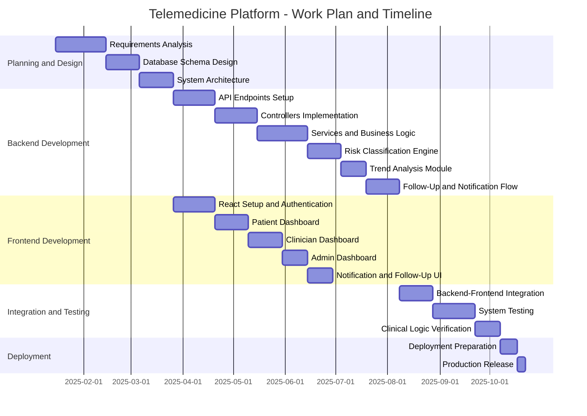
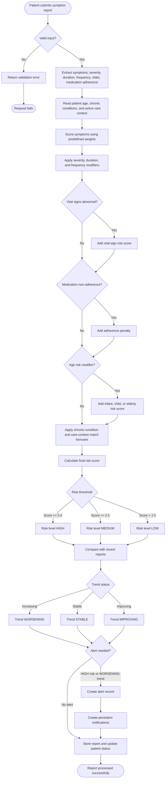
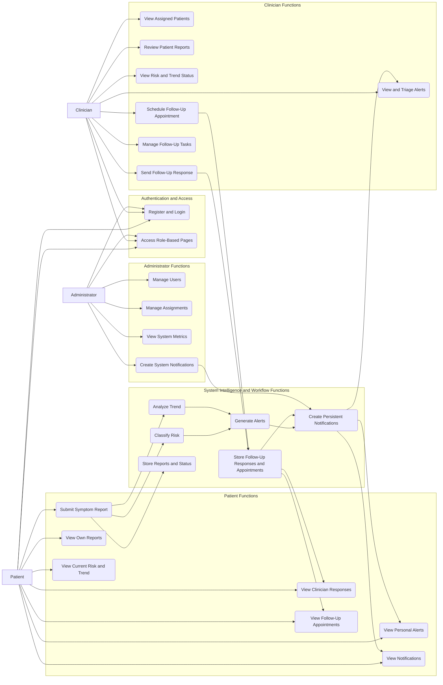
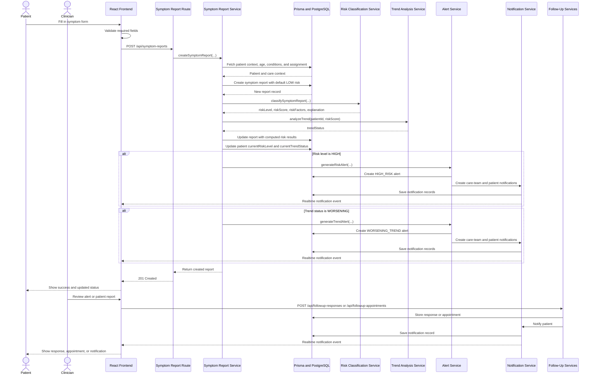
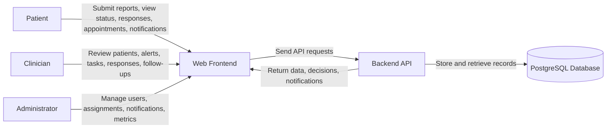
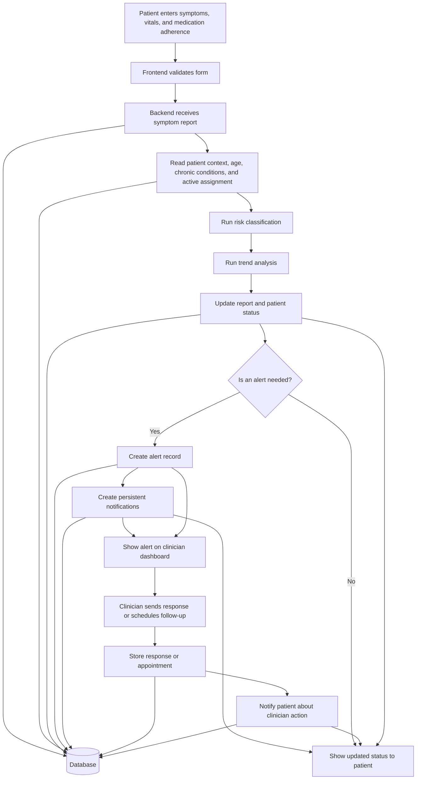
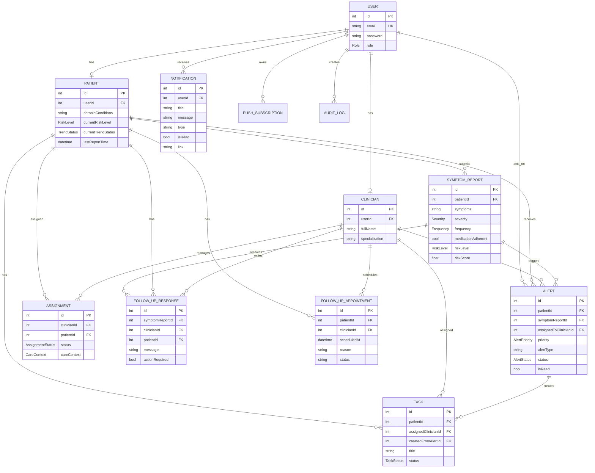
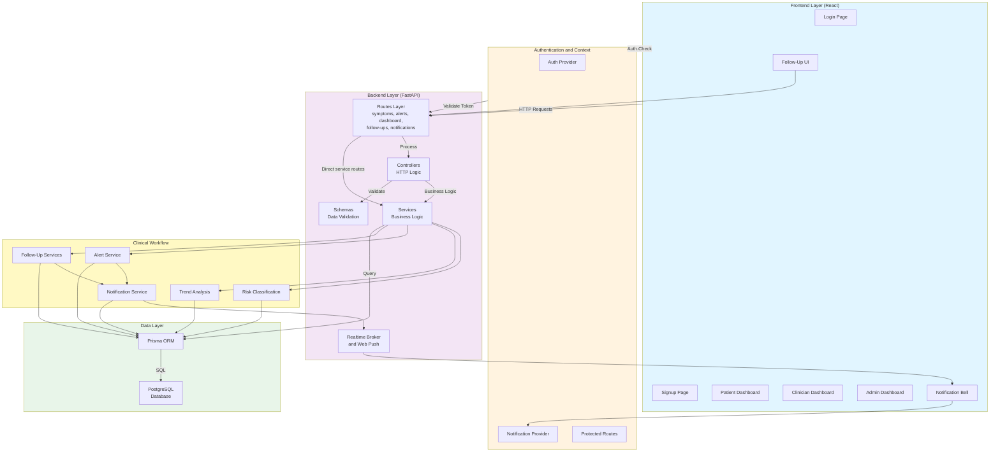
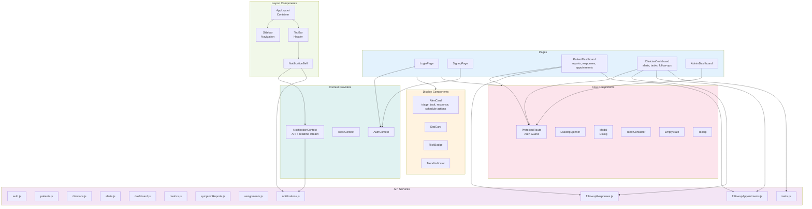

# Mermaid Diagrams for Thesis

Copy and paste each code block below into your markdown files. These diagrams match the current implementation, including follow-up responses, follow-up appointments, persistent notifications, tasks, and the expanded risk context.

---

## 1.9 Work Plan - Gantt Chart

---

## 3.3 Methods/Techniques - Rule-Based Algorithm Flowchart

---

## 4.3.1 Use-Case Diagram - System Boundaries and User Roles

---

## 4.3.2 Sequence Diagram - Symptom Report and Follow-Up Flow

---

## 4.4.1 Context Diagram and DFD

---

## 4.4.4 Database Design - Entity Relationship Diagram (ERD)

---

## Additional System Architecture Diagrams

### System Architecture Overview

### Frontend Component Architecture

---

## How to Use

1. Open VS Code.
2. Create or edit a markdown file (`.md`).
3. Find the diagram you need above.
4. Copy the entire code block between the triple backticks.
5. Paste it into your markdown file.
6. Install a Mermaid preview extension if your editor does not render Mermaid by default.
