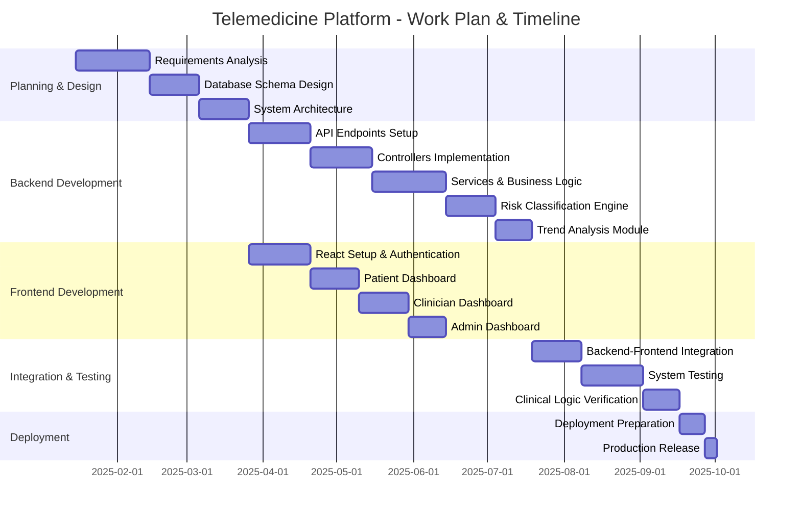
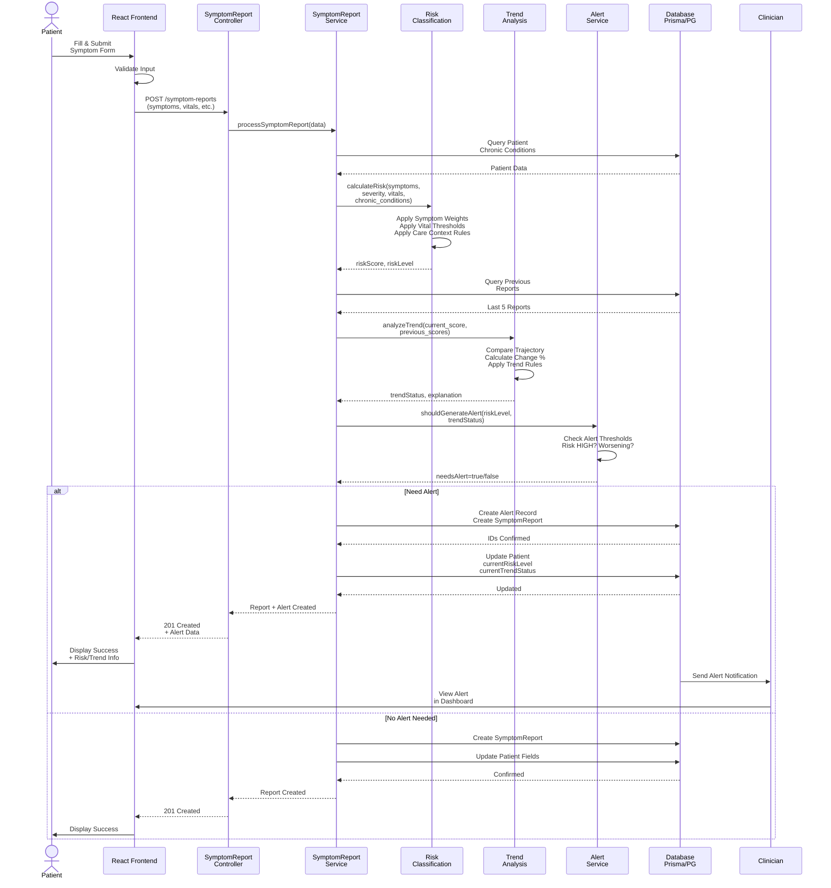
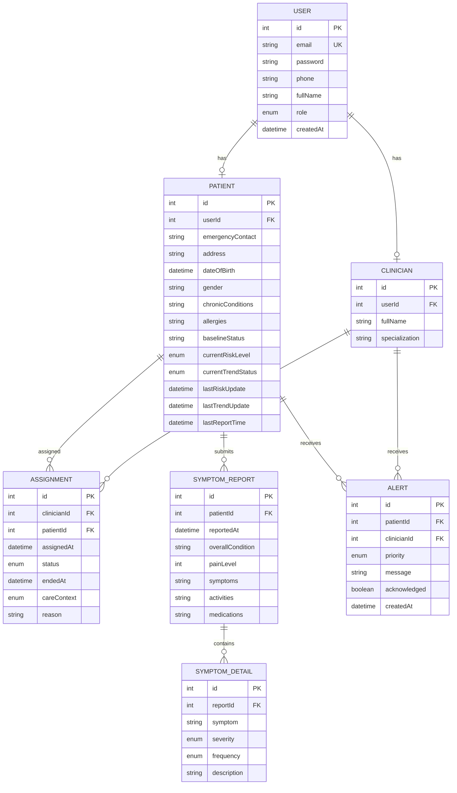
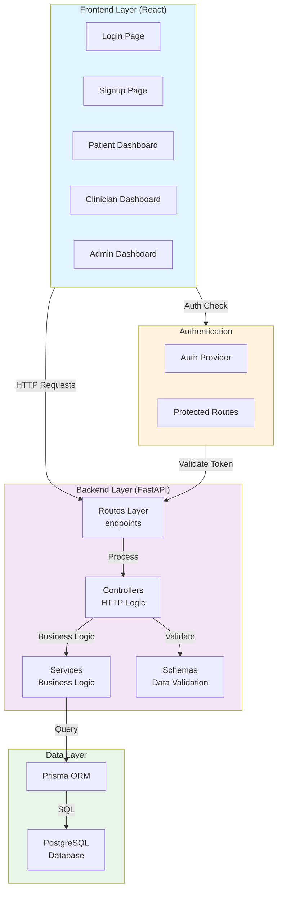
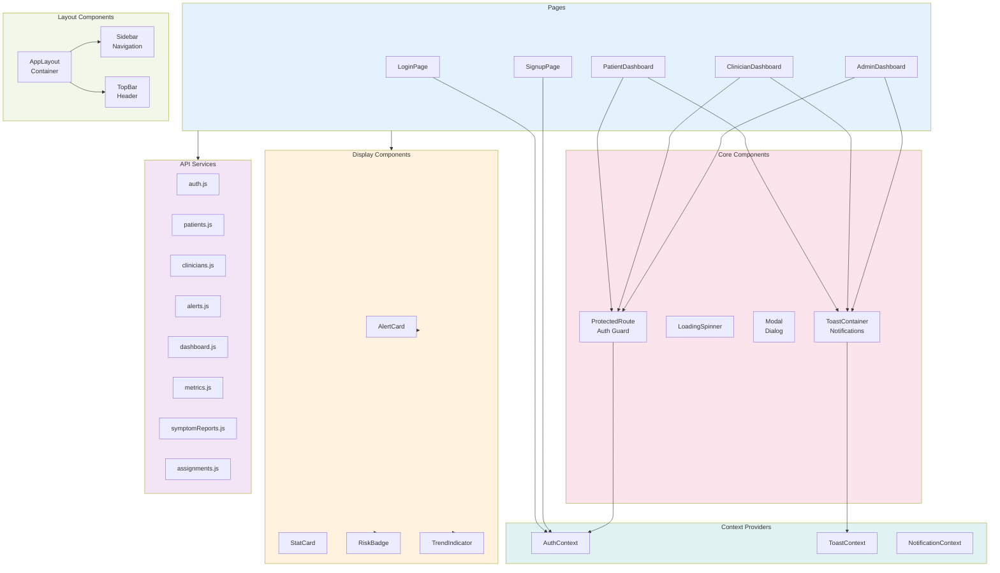
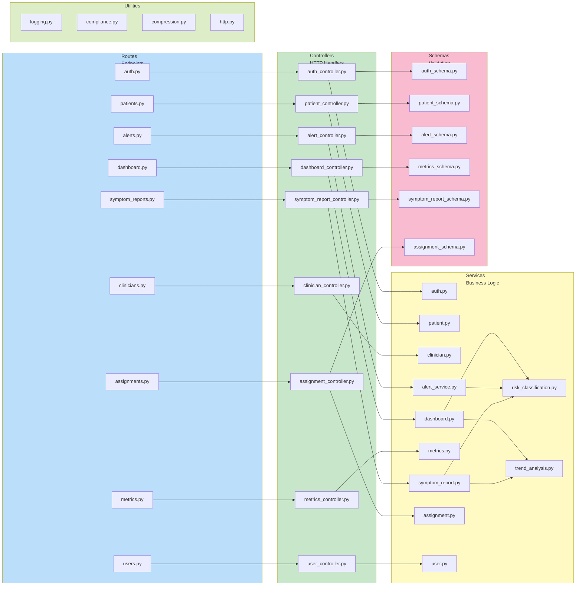

# Mermaid Diagrams for Thesis

Copy and paste each code block below into your markdown files.

---

## 1.9 Work Plan - Gantt Chart



---

## 3.3 Methods/Techniques - Rule-Based Algorithm Flowchart

```mermaid
flowchart TD
    Start(["Patient Submits<br/>Symptom Report"]) --> Validate{Valid Input?}
    
    Validate -->|No| Error["Return<br/>Validation Error"]
    Error --> End1(["Request Fails"])
    
    Validate -->|Yes| Extract["Extract Features:<br/>• Symptoms<br/>• Severity<br/>• Frequency<br/>• Vital Signs<br/>• Medications"]
    
    Extract --> CheckChronic{Patient has<br/>Chronic<br/>Conditions?}
    
    CheckChronic -->|Yes| ApplyContext["Apply Care Context<br/>Rules"]
    CheckChronic -->|No| BaselineScore["Calculate Base Risk<br/>Score"]
    
    ApplyContext --> BaselineScore
    
    BaselineScore --> SympScore["Score Each Symptom:<br/>• Weight × Severity<br/>• Duration Bonus<br/>• Frequency Multiplier"]
    
    SympScore --> AggScore["Aggregate Symptom<br/>Score"]
    
    AggScore --> VitalCheck{Vital Signs<br/>Critical?}
    
    VitalCheck -->|Yes| VitalBonus["Add Critical<br/>Vital Bonus"]
    VitalCheck -->|No| MedCheck{Medication<br/>Non-Adherence?}
    
    VitalBonus --> MedCheck
    
    MedCheck -->|Yes| MedBonus["Add Adherence<br/>Penalty"]
    MedCheck -->|No| FinalScore["Calculate Final<br/>Risk Score"]
    
    MedBonus --> FinalScore
    
    FinalScore --> ClassifyRisk{Risk Score<br/>Threshold?}
    
    ClassifyRisk -->|Score ≤ 30| RiskLow["RISK LEVEL<br/>= LOW"]
    ClassifyRisk -->|Score 31-70| RiskMed["RISK LEVEL<br/>= MEDIUM"]
    ClassifyRisk -->|Score ≥ 71| RiskHigh["RISK LEVEL<br/>= HIGH"]
    
    RiskLow --> CompareTrend["Compare With<br/>Previous Reports"]
    RiskMed --> CompareTrend
    RiskHigh --> CompareTrend
    
    CompareTrend --> AnalyzeTrend{Trend<br/>Status?}
    
    AnalyzeTrend -->|Score Increasing| Worsening["TREND<br/>= WORSENING<br/>Priority: HIGH"]
    AnalyzeTrend -->|Score ±10%| Stable["TREND<br/>= STABLE"]
    AnalyzeTrend -->|Score Decreasing| Improving["TREND<br/>= IMPROVING"]
    
    Worsening --> AlertCheck{Generate<br/>Alert?}
    Stable --> AlertCheck
    Improving --> AlertCheck
    
    AlertCheck -->|Risk HIGH or<br/>Worsening| CreateAlert["Create Alert<br/>Priority = HIGH"]
    AlertCheck -->|Risk MEDIUM<br/>& Worsening| CreateAlert
    AlertCheck -->|Risk LOW &<br/>Stable| NoAlert["No Alert"]
    
    CreateAlert --> NotifyClinic["Notify Assigned<br/>Clinicians"]
    NoAlert --> Store["Store Report<br/>in Database"]
    NotifyClinic --> Store
    
    Store --> UpdatePatient["Update Patient:<br/>• currentRiskLevel<br/>• currentTrendStatus<br/>• lastReportTime"]
    
    UpdatePatient --> Success(["Report Processed<br/>Successfully"])
```



---

## 4.3.1 Use-Case Diagram - System Boundaries & User Roles

```mermaid
usecase
    actor Patient
    actor Clinician
    actor Administrator
    actor System
    
    usecase UC1 as "Register/Login"
    usecase UC2 as "Submit Symptom Report"
    usecase UC3 as "View Own Health Data"
    usecase UC4 as "Receive Alerts"
    
    usecase UC5 as "View Assigned Patients"
    usecase UC6 as "Review Symptom Reports"
    usecase UC7 as "Send Alerts"
    usecase UC8 as "Track Patient Trends"
    usecase UC9 as "View Metrics"
    
    usecase UC10 as "Manage Users"
    usecase UC11 as "Manage Assignments"
    usecase UC12 as "System Configuration"
    usecase UC13 as "View System Metrics"
    
    usecase UC14 as "Classify Risk"
    usecase UC15 as "Analyze Trends"
    usecase UC16 as "Generate Alerts"
    usecase UC17 as "Persist Data"
    
    Patient --> UC1
    Patient --> UC2
    Patient --> UC3
    Patient --> UC4
    
    Clinician --> UC1
    Clinician --> UC5
    Clinician --> UC6
    Clinician --> UC7
    Clinician --> UC8
    Clinician --> UC9
    
    Administrator --> UC1
    Administrator --> UC10
    Administrator --> UC11
    Administrator --> UC12
    Administrator --> UC13
    
    System --> UC14
    System --> UC15
    System --> UC16
    System --> UC17
    
    UC2 ..> UC14: triggers
    UC2 ..> UC15: triggers
    UC14 ..> UC16: triggers
    UC16 ..> UC4: notifies
    UC16 ..> UC7: notifies
    
    UC2 ..> UC17: persists
    UC11 ..> UC17: persists
```

---

## 4.3.2 Sequence Diagram - Symptom Report Data Flow



---

## 4.4.4 Database Design - Entity Relationship Diagram (ERD)



---

## Additional System Architecture Diagrams

### System Architecture Overview



### Frontend Component Architecture



### Backend Architecture - MVC Pattern



---

## How to Use:

1. Open VS Code
2. Create or edit a markdown file (.md)
3. Find the diagram you need above
4. Copy the entire code block (between the triple backticks)
5. Paste it into your markdown file
6. Install "Markdown Preview Mermaid Support" extension
7. The diagram will render automatically in VS Code preview

