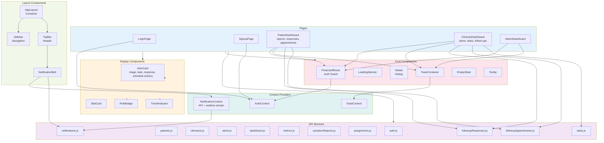

# Frontend Component Architecture

```mermaid
graph TB
    subgraph Pages["Pages"]
        LP["LoginPage"]
        SP["SignupPage"]
        PD["PatientDashboard<br/>reports, responses, appointments"]
        CD["ClinicianDashboard<br/>alerts, tasks, follow-ups"]
        AD["AdminDashboard"]
    end

    subgraph Layout["Layout Components"]
        Sidebar["Sidebar<br/>Navigation"]
        TopBar["TopBar<br/>Header"]
        AppLayout["AppLayout<br/>Container"]
        NB["NotificationBell"]
    end

    subgraph Core["Core Components"]
        PR["ProtectedRoute<br/>Auth Guard"]
        LS["LoadingSpinner"]
        Modal["Modal<br/>Dialog"]
        Toast["ToastContainer"]
        Empty["EmptyState"]
        Tooltip["Tooltip"]
    end

    subgraph Display["Display Components"]
        AC["AlertCard<br/>triage, task, response, schedule actions"]
        SC["StatCard"]
        RB["RiskBadge"]
        TI["TrendIndicator"]
    end

    subgraph Context["Context Providers"]
        Auth["AuthContext"]
        Toast_Ctx["ToastContext"]
        Notif["NotificationContext<br/>API + realtime stream"]
    end

    subgraph API["API Services"]
        AuthAPI["auth.js"]
        PatientAPI["patients.js"]
        ClinicianAPI["clinicians.js"]
        AlertAPI["alerts.js"]
        DashAPI["dashboard.js"]
        MetricsAPI["metrics.js"]
        SymptomAPI["symptomReports.js"]
        AssignmentAPI["assignments.js"]
        TaskAPI["tasks.js"]
        FollowRespAPI["followupResponses.js"]
        FollowApptAPI["followupAppointments.js"]
        NotificationAPI["notifications.js"]
    end

    LP --> Auth
    SP --> Auth
    PD --> PR
    CD --> PR
    AD --> PR

    AppLayout --> Sidebar
    AppLayout --> TopBar
    TopBar --> NB
    NB --> Notif

    PD --> Toast
    CD --> Toast
    AD --> Toast

    Pages --> Display
    Pages --> Core
    Display --> AC
    Display --> RB
    Display --> TI

    PD --> FollowRespAPI
    PD --> FollowApptAPI
    CD --> FollowRespAPI
    CD --> FollowApptAPI
    CD --> TaskAPI
    Pages --> API

    PR --> Auth
    Toast --> Toast_Ctx
    NB --> NotificationAPI
    Notif --> NotificationAPI

    style Pages fill:#e3f2fd
    style Layout fill:#f1f8e9
    style Core fill:#fce4ec
    style Display fill:#fff3e0
    style Context fill:#e0f2f1
    style API fill:#f3e5f5
```
