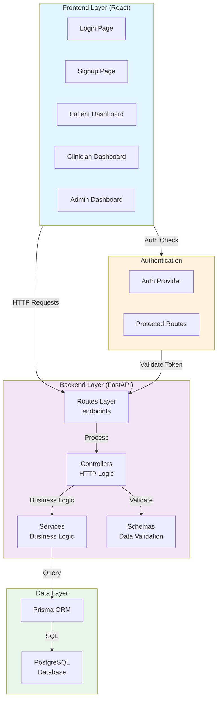

# System Architecture Overview

```mermaid
graph TB
    subgraph Client["Frontend Layer (React)"]
        LP["Login Page"]
        SP["Signup Page"]
        PD["Patient Dashboard"]
        CD["Clinician Dashboard"]
        AD["Admin Dashboard"]
    end

    subgraph Auth["Authentication"]
        AP["Auth Provider"]
        ProtectedRoute["Protected Routes"]
    end

    subgraph API["Backend Layer (FastAPI)"]
        Routes["Routes Layer<br/>endpoints"]
        Controllers["Controllers<br/>HTTP Logic"]
        Services["Services<br/>Business Logic"]
        Models["Schemas<br/>Data Validation"]
    end

    subgraph DB["Data Layer"]
        Prisma["Prisma ORM"]
        PostgreSQL["PostgreSQL<br/>Database"]
    end

    Client -->|HTTP Requests| Routes
    Client -->|Auth Check| Auth
    Auth -->|Validate Token| Routes
    Routes -->|Process| Controllers
    Controllers -->|Business Logic| Services
    Controllers -->|Validate| Models
    Services -->|Query| Prisma
    Prisma -->|SQL| PostgreSQL
    
    style Client fill:#e1f5ff
    style API fill:#f3e5f5
    style DB fill:#e8f5e9
    style Auth fill:#fff3e0
```
