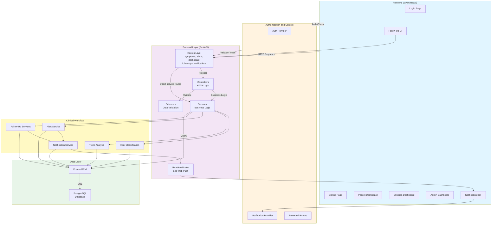

# System Architecture Overview

```mermaid
graph TB
    subgraph Client["Frontend Layer (React)"]
        LP["Login Page"]
        SP["Signup Page"]
        PD["Patient Dashboard"]
        CD["Clinician Dashboard"]
        AD["Admin Dashboard"]
        NB["Notification Bell"]
        FU["Follow-Up UI"]
    end

    subgraph Auth["Authentication and Context"]
        AP["Auth Provider"]
        NP["Notification Provider"]
        ProtectedRoute["Protected Routes"]
    end

    subgraph API["Backend Layer (FastAPI)"]
        Routes["Routes Layer<br/>symptoms, alerts, dashboard,<br/>follow-ups, notifications"]
        Controllers["Controllers<br/>HTTP Logic"]
        Services["Services<br/>Business Logic"]
        Models["Schemas<br/>Data Validation"]
        Realtime["Realtime Broker<br/>and Web Push"]
    end

    subgraph Workflow["Clinical Workflow"]
        Risk["Risk Classification"]
        Trend["Trend Analysis"]
        Alert["Alert Service"]
        FollowUp["Follow-Up Services"]
        Notify["Notification Service"]
    end

    subgraph DB["Data Layer"]
        Prisma["Prisma ORM"]
        PostgreSQL["PostgreSQL<br/>Database"]
    end

    Client -->|HTTP Requests| Routes
    Client -->|Auth Check| Auth
    NB --> NP
    FU --> Routes
    Auth -->|Validate Token| Routes
    Routes -->|Process| Controllers
    Routes -->|Direct service routes| Services
    Controllers -->|Business Logic| Services
    Controllers -->|Validate| Models
    Services --> Risk
    Services --> Trend
    Services --> Alert
    Services --> FollowUp
    Alert --> Notify
    FollowUp --> Notify
    Notify --> Realtime
    Realtime --> NB
    Services -->|Query| Prisma
    Risk --> Prisma
    Trend --> Prisma
    Alert --> Prisma
    FollowUp --> Prisma
    Notify --> Prisma
    Prisma -->|SQL| PostgreSQL

    style Client fill:#e1f5ff
    style API fill:#f3e5f5
    style DB fill:#e8f5e9
    style Auth fill:#fff3e0
    style Workflow fill:#fff9c4
```
